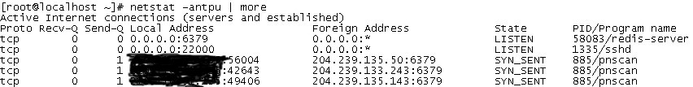

- [iptable 변경](https://upcloud.com/community/tutorials/configure-iptables-centos/)
  - _sudo iptables -A INPUT -p tcp -m tcp --dport 6379 --tcp-flags FIN,SYN,RST,ACK SYN -j ACCEPT_
  - _iptables --flush_ : 위의 6379 포트 ACCEPT 정책 제거
  - _service iptables save_ : save to _/etc/sysconfig/iptables_


```
# Generated by iptables-save v1.4.7 on Mon Aug 23 13:42:46 2021
*filter
:INPUT ACCEPT [430:123417]
:FORWARD ACCEPT [0:0]
:OUTPUT ACCEPT [416:122587]
-A INPUT -p tcp -m tcp --dport 6379 --tcp-flags FIN,SYN,RST,ACK SYN -j ACCEPT
COMMIT
# Completed on Mon Aug 23 13:42:46 2021
```

- 레디스 기본포트 오픈 후 Unknown Traffic
  - /var/tmp/.system에 Monero마이닝 스크립트 및 실행 프로세스 탐지
  - LKM rootkit (malware)관련 파일확인 ```/var/tmp/.../diamorphine```, ```/var/tmp/.alsp```
  - 아웃바운드 트래픽 발생




- 처리
  - 해당 프로세스 kill 및 /var/tmp/.system 디렉토리 삭제
  - 실행 중 레디스 프로세스 kill
  - 방화벽 레디스 기본포트 6379 closed처리

- 추후 방안
  - 기본포트 6379 사용자제
  - 방화벽 포트 오픈시 특정 IP로 Source IP 제한 (e.g. 스타패스 서버 IP)
