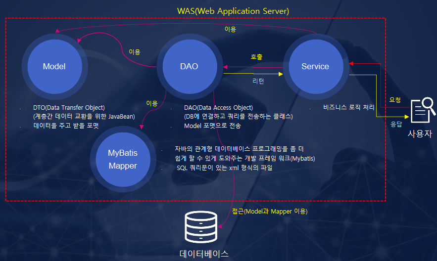

- 스프링 컨테이너
	- '애플리케이션 컨텍스트' 스프링 런타임
	- 애플리케이션 오브젝트 생성하고 관리: 웹모듈에서 동작하는 서비스나 서블릿으로 등록해서 사용
- 공통 프로그래밍 모델
	- IoC/DI 오브젝트 생명주기와 의존관계에 대한 프로그래밍 모델
	- 서비스 추상화
	- AOP 모델

- Simplicity: EJB -> 객체지향 POJO
- Flexibility

- DAO (Data Access Object) 데이터 조회 및 조작하는 기능 전담하는 오브젝트

```java
package springbook.user.domain;

public class User {
	String id;
	String name;
	String password;
	//public Getter, Setter
}
```

- JavaBean 조건
	- 디폴트 생성자
	- 프로퍼티 (getter, setter)

- UserDao
	- 사용자정보를 DB에 넣고 관리할 수 있는 UserDao 클래스
	- 등록, 수정, 삭제, 조회
	- JDBC 사용
		- DB연결 connection
		- SQL 담은 Statement / PreparedStatement 생성
		- Statement 실행
		- 조회의 경우 ResultSet로 받아서 오브젝트(user)에 옮겨줌
		- Connection, Statement, ResultSet 등 리소스는 close() 해준다
		- JDBC API가 만들어내는 exception을 직접 처리하거나 메소드에 throws 선언하여 메소드 밖으로 던짐

- DAO의 분리
	- 애플리케이션 설계 변경에따른 영향도 최소화
	- 관심사의 분리

- UserDao의 관심사 (1. DB 커넥션, 2. DB Statement 실행, 3. 리소스 close())

- 커넥션만들기 추출 getConnection()
  - mysql-connector-java-8.0.29.jar 다운로드, classpath 추가

```sh
docker run -d -p 3306:3306 -e MYSQL_ROOT_PASSWORD=root --name mysql8 mysql:8.0 --lower_case_table_names=1
docker exec -it CONTAINTER_ID sh

> mysql -u root -p
Enter password: root

# % 인 경우 외부 remote access 허용 
# localhost 인 경우 localhost만 허용 
# IP 인 경우 해당 IP만 허용 (192.168.0.% 인 경우 Host 대역 허용)
CREATE USER 'spring'@'%' IDENTIFIED BY 'book'; 
GRANT ALL PRIVILEGES ON *.* TO 'spring'@'%';
GRANT ALL PRIVILEGES ON springbook.* TO 'spring'@'%' WITH GRANT OPTION;
# DROP USER 'spring'@'%';

> exit
> mysql -u spring -p
Enter password: book

> show databases;

# 데이터베이스 생성 
> CREATE DATABASE `springbook` CHARACTER SET utf8;
> USE springbook;

> CREATE TABLE USERS  (
	ID VARCHAR(10) PRIMARY KEY,
	NAME VARCHAR(20) NOT NULL,
	PASSWORD VARCHAR(10) NOT NULL
);
```

```java
public class UserDao {
	public void add(User user) throws ClassNotFoundException, SQLException {
		Connection c = getConnection();
		
		PreparedStatement ps = c.prepareStatement(
				"insert into users(id, name, password) values(?,?,?)");
		ps.setString(user.getId());
		ps.setString(user.geName());
		ps.setString(user.getPassword());
		ps.executeUpdate();

		ps.close();
		c.close();
	}

	public User get(String id) throws ClassNotFoundException, SQLException {
		Connection c = getConnection();
		
		PreparedStatement ps = c.prepareStatement(
				"select * from users where id = ?");
		ps.setString(id);
		
		ResultSet rs = ps.executeQuery();
		rs.next();

		User user = new User();
		user.setId(rs.getString("id"));
		user.setName(rs.getString("name"));
		user.setPassword(rs.getString("password"));

		rs.close();
		ps.close();
		c.close();

		return user;
	}

	public Connection getConnection() throws ClassNotFoundException, SQLException {
		Class.forName("com.mysql.jdbc.Driver");
		Connection c = DriverManager.getConnection(
				"jdbc:mysql://localhost/springbook", "spring", "book"
		);
		return c;
	}
}
```

```java
public class Main {
	public static void main(String[] args) {
		UserDao dao = new UserDao();

		User user = new User();
		user.setId("1");
		user.setName("Bob");
		user.setPassword("fooo");

		dao.add(User);
		System.out.Println(user.getId() + " 등록 성공");

		User user2 = dao.get(user.getId());
		System.out.Println("조회 성공: name=" + user2.getName());
		System.out.Println("조회 성공: password=" + user2.getPassword());

		System.out.Println(user.getId() + " 조회 성공");
	}
}
```

- 커넥션만들기 독립
	- UserDao 코드 제공 시, 각 업체들이 getConnection() 자체 구현 DB 커넥션 코드 사용하려 함
		- UserDao 개발자가 코드를 공개하지 않고 바이너리만 제공하고자 할때, 구현방법
		- => 상속을 통한 확장 (class extends abstract class)
	- UserDao 확장 클래스의 DB연결 인터페이스 제공: 상속(inheritance)

- 템플릿 메소드 패턴
	- 슈퍼클래스에서 기본적인 로직 흐름 만들고
	- 서브클래스에서 그 기능의 일부를 추상메소드나 오버라이딩 가능한 protected 메소드로 만드는 방법
	- `protectded void hookMethod() {}`: 선택적으로 오버라이드
	- `public abstract void abstractMethod() {}`: 반드시 오버라이드

- 팩토리 메소드 패턴 : 서브클래스에서 구체적인 오브젝트 생성방법 결정
	- "UserDao에 팩토리 메소드 패턴을 적용해서 getConnection()을 분리"
	- "디자인패턴": 소프트웨어 설계시 특정 상황에서 자주만나는 문제를 해결하기 위한 재사용 가능한 솔루션
	- 객체 생성방법을 결정하고, 그렇게 만들어진 오브젝트를 돌려주는 오브젝트
	- UserDao, ConnectionMaker: 애플리케이션의 핵심적인 데이터 로직과 기술 로직
	- DaoFactory:  애플리케이션의 오브젝트들을 구성하고 그 관계를 정의

```
UserDao [add(), get(), getConnection()]
	ㄴNUserDao [getConnection()]
	ㄴDUserDao [getConnection()]
```

```java
public class UserDao {

	public void add(User user) throws ClassNotFoundException, SQLException {
		Connection c = getConnection();
		PreparedStatement ps = c.preparedStatement(
			"insert into users(id, name, password) values(?,?,?)");
		ps.setString(1, user.getId());
		ps.setString(2,user.getName());
		ps.setString(3, user.getPassword());
		ps.executeUpdate();

		ps.close();
		c.close();
	}

	public User get(String id) throws ClassNotFoundException, SQLException {
		Connection c = getConnection();
		PreparedStatement ps = c.preparedStatement(
			"select * from users where id=?");
		ps.setString(1, id);

		ResultSet rs = ps.executeQuery();
		rs.next();
		User user = new User();
		user.setId(rs.getString("id"));
		user.setName(rs.getString("name"));
		user.setPassword(rs.getString("password"));

		rs.close();
		ps.close();
		c.close();
	}

	// 추상메소드-> 메소드구현은 서브클래스가 담당
	// 또는 오버라이딩이 가능한 'protected' 메소드 정의
	public abstract Connection getConnection() throws ClassNotFoundException, SQLException;

}
```

```java
public class NUserDao extends UserDao{
	// add, get은 상속됨

	// N사의implementation
	public Connection getConnection() throws ClassNotFoundException, SQLException {
		Class.forName("com.mysql.jdbc.Driver");
		Connection c = DriverManager.getConnection(
			"jdbc:mysql://localhost/springbook", "spring", "book"
		);
		return c;
	}
}
```

```java
public class DUserDao extends UserDao{
	// add, get은 상속됨

	// D사의implementation
	public Connection getConnection() throws ClassNotFoundException, SQLException {
		//...
	}

}
```

- 추상클래스의 getConnection() 이 protected 메소드라면,
	- @Override 어노테이션으로 getConnection() 오버라이드
	- abstract와 protected 차이점

```
abstract 메소드는 abstract 로 선언된 클래스의 구현부를 일부러 비어놓아서,
그것을 상속하는 클래스는 반드시 해당 메소드를 구현해주어야 함
부모클래스는 그자체로는 존재 할수 없고, 추상적인 개념일 뿐이다.
제 세상에 태어나는(instance)것은  자식 클래스에 의해서 이루어 지기 때문에, 
자식 클래스는 반드시 abstract를 구현해야만 한다.

이에 반해 protected로 구현된 메소드는 반드시 자식클래스가 Override를 해야 할 필요가 없다.
대부분의 경우에는 상속하는 클래스가 직접 구현할 필요는 없지만,
그래도 특수한 상황에서는 protected로 선언된 메소드는 override해서 처리해야 할 수도 있음을
유저에게 알려주는 것이다. 즉 protected는 클래스 상속을 하는 개발자에게 주의를 주는 방식인 셈이다.
(abtraction은 override를 강제하는 구조라고 볼 수 있다)
```

- 상속의 한계점
	- 다중상속 문제발생
		- 만약 UserDao가 다른목적으로 다른 상속을 이미 사용하고 있다면?
	- 상속 상하위 클래스 관계는 생각보다 너무 밀접
		- 서브클래스가 슈퍼클래스 기능 여전히 사용 가능
		- 슈퍼클래스 수정 시, 서브 클래스도 코드 수정소요
	- 커넥션 생성 확장기능을 다른 Dao클래스에서 사용 X
		- Dao클래스 추가시 구현 코드가 계속 중복

- 클래스의 분리
	- DB 커넥션 제공하는 클래스 정의
	- 하지만 N, D사의 UserDao 확장 시, UserDao클래스만 제공하고,
	- 커넥션기능 각 업체별 구현 제공 불가능 해짐 (처음 문제로 복귀)
		- UserDao 코드 수정 없이 D사 구현 커넥션 제공 메소드 사용 불가능 (e.g. D사의 openConnection())
		- DB커넥션을 제공하는 클래스가 뭔지 UserDao클래스가 알고 있어야 함!
			- UserDao가 DB커넥션 가져오는 구체적인 방법에 종속 되어 버림

```java
package springbook.user.dao;

public class SimpleConnectionMaker {
	public Connection makeConnection() throws ClassNotFoundException, SQLException {
		Class.forName("com.mysql.jdbc.Driver");
		Connection c = DriverManger.getConnection(
			"jdbc:mysql//localhost/springbook", "spring", "book");
		return c;
	}
}
```

```java
public class UserDao {
	private SimpleConnectionMaker simpleConnectionMaker;

	public UserDao() {
		simpleConnectionMaker = new SimpleConnectionMaker();
	}

	public void add(User user) throws ClassNotFoundException, SQLException {
		Connection c = simpleConnectionMaker.makeConnection();
		// ...
	}

	public User get(String id) throws ClassNotFoundException, SQLException {
		Connection c = simpleConnectionMaker.makeConnection();
		// ...
	}
}
```


- 인터페이스의 독립
  - 두개 클래스가 긴밀하게 연결되어 있지 않도록 중간에 추상적인 느슨한 연결고리 정의

```java
package springbook.user.dao;

public interface ConnectionMaker {
	public Connection makeConnection() throws ClassNotFoundException, SQLException;
}
```

```java
package springbook.user.dao;

public class DConnectionMaker implements ConnectionMaker {
	public Connection makeConnection() throws ClassNotFoundException, SQLException {
		Class.forName("com.mysql.jdbc.Driver");
		Connection c = DriverManger.getConnection(
				"jdbc:mysql//localhost/springbook", "spring", "book");
		return c;
	}
}
```

```java
package springbook.user.dao;

public class NConnectionMaker implements ConnectionMaker {
	public Connection makeConnection() throws ClassNotFoundException, SQLException {
		Class.forName("com.mysql.jdbc.Driver");
		Connection c = DriverManger.getConnection(
		"jdbc:mysql//localhost/springbook", "spring", "book");
		return c;
	}
}
```

- 인터페이스 사용시 문제점
  - UserDao에서 커넥션을 만들때 인터페이스는 '초기화 불가능'하여 D사의 커넥션메이커 사용함
  - 구체적인 클래스까지 알아야하는 문제 발생. DB커넥션 기능의 확장이 자유롭지 못함
  - UserDao는 독립적으로 확장가능한 클래스로서 역할 못하게 됨
  - UserDao에는 어떤 ConnectionMaker 구현클래스를 사용할지를 결정하는 코드가 남아있음
  - 생성자에서 오브젝트를 정의하는것이 아닌, 외부에서 래퍼런스를 받아서 사용도 가능

```java
package springbook.user.dao;

public class UserDao {

	private ConnectionMaker connectionMaker;
	public UserDao() {
		connectionMaker = new DConnectionMaker();
	}
}
```


- 관계설정 책임의 분리
  - UserDao가 ConnectionMaker 구현 클래스 까지 알아야 하는 문제 있음
  - UserDao 코드변경 없이는 DB 커넥션 기능 확장이 자유롭지 못함 (독립적으로 확장 가능한 클래스가 아님)
  - 외부에서 ConnectionMaker 구현체를 파라미터로 받도록 수정
  - UserDaoTest가 ConnectionMaker 클래스를 선정하는 책임 담당하도록 변경

```java
public class UserDao {

	private ConnectionMaker connectionMaker;

	public UserDao(ConnectionMaker connectionMaker) {
		this.connectionMaker = connectionMaker;
	}
}
```
```java
public class Main {
	public static void main(String[] args) throws ClassNotFoundException, SQLException {
		// ...
		ConnectionMaker connectionMaker = new DConnectionMaker();
		UserDao dao = new UserDao(connectionMaker);
		dao.add(user);
		// ...
	}

}
```

- 원칙과 패턴
	- 개방 폐쇄 원칙
	- 높은 응집도
	- 낮은 결합도
	- 전략 패턴

- 객체지향 설계 원칙 SOLID
	- 단일 책임원칙
	- 개발 폐쇄 원칙
	- 리스코프 치환 원칙
	- 인터페이스 분리 원칙
	- 의존관계 역전 원칙

- 제어의 역전
	- UserDao의 클라이언트인 UserDaoTest가 엉겹결에 ConnectionMaker 클래스 결정을 떠안음
  - 추가기능분리 필요 :
    - UserDao, ConnectionMaker 구현클래스 오브젝트 생성
    - 그렇게 만들어진 두개 오브젝트가 연결돼서 사용 될 수 있도록 관계 맺어주기
    - 분리기능 담당할 클래스(Factory) 생성 : 객제 생성방법을 결정하고 오브젝트를 돌려줌 (DaoFactory)
  - 팩토리: 객체생성 방법 결정하고 그렇게 만들어진 오브젝트 반환하는 일을하는 오브젝트

- DaoFactory가 UserDao, ConnectionMaker 생성작업 하도록 수정
	- UserDao는 바이너리, DaoFactory는 코드로 제공. (세부 구현코드는 숨길 수 있음)
	- 애플리케이션 컴포넌트, 애플리케이션 구조결정 오브젝트를 분리

- 설계도로서의 팩토리
	- UserDao, ConnectionMaker는 각각 애플리케이션의 핵심적인 데이터로직과 기술로직 담당 (실질적인 로직)
	- DaoFactory는 이런 애플리케이션의 오브젝트들을 구성하고 그 관계를 정의하는 책임
		- (애플리케이션을 구성하는 컴포넌트의 구조와 관계를 정의한 설계도 역할)
	- DaoFactory는 소스 제공, UserDao 등 핵심 기능은 가려져 있지만 활용 가능하도록 제공


```java
package springbook.user.dao;

public class DaoFactory {

	public UserDao userDao() {
		return new UserDao(connectionMaker());
	}

//	public AccountDao userDao() {
//		return new AccountDao(connectionMaker());
//	}
//	public MessageDao userDao() {
//		return new MessageDao(connectionMaker());
//	}

	public ConnectionMaker connectionMaker() {
		return new DConnectionMaker();
	}
}
```

```java
public class UserDaoTest {
	
	public static void main(String[] args) throws ClassNotFoundException, SQLException {
		UserDao dao = new DaoFactory().userDao();
		dao.add(user);
		System.out.println(user.getId() + " 등록성공");
	}
}
```

- 제어권의 이전을 통한 제어관계 역전
	- main()에서 사용 오브젝트 결정, 생성, 오브젝트 메소드 호출 (모든작업을 사용하는 쪽에서 제어)
	- 이런 흐름을 역전하여 자신이 사용할 오브젝트를 스스로 선택하거나 생성하지 않음
	- 위임받은 제어 권한을 갖는 특별한 오브젝트에 의해 결정되고 만들어지도록 함
	- 제어권을 상위 템플릿 메소드에 넘기고 자신은 필요할 때, 호출되어 사용되도록 함
		- (UserDao가 add, get에서 필요시 호출-getConnection()의 하위 메소드)
	- 프레임워크 vs 라이브러리
		- 프레임워크: 제어의 역전이 적용된 대표 기술. 애플리케이션 코드가 프레임워크에 의해 사용됨
		- 라이브러리 사용 어플리케이션코드는 애플리케이션 흐름을 직접 제어
  - DaoFactory는 가장 단순한 IoC 컨테이너로, IoC 프레임워크로서 역할을 함
		- UserDao가 가지고있던 어떤 ConnectionMaker 만들고 사용할지에 대한 권한을 DaoFactory에 넘김
		- UserDao도 DaoFactory에 의해 수정적으로 만들어지고, 자신이 사용할 오브젝트도 DaoFactory가 공급


- 스프링 IOC
	- DaoFactory를 스프링에서 사용가능 하도록 변경 작업
	- 스프링 빈:
		- 스프링이 제어권을 가지고 직접 만들고 관계를 부여하는 오브젝트
		- 오브젝트 단위의 애플리케이션 컴포넌트
		- 스프링 컨테이너가 생성과 관계설정, 사용 등을 제어해주는 제어의 역전이 적용된 오브젝트
	- 빈팩토리 : 빈의 생성과 관계설정 제어 담당하는 IoC 오브젝트
	- 어플리케이션 컨텍스트 : IoC방식을 따라 만들어진 일종의 빈팩토리-> 좀더 확장한 개념
    - 애플리케이션 전반에 걸쳐 모든 구성요소의 제어 작업을 담당하는 IoC 엔진
  	- DaoFactory와 같이 어떤클래스 오브젝트 생성하고, 어디에서 사용하도록 연결 등 정보는 X
    - 대신, 설정정보를 담고있는 무엇인가를 가져와 이를 활용하는 범용적인 IoC엔진
    - 자바코드로 만든 애플리케이션 컨텍스트의 설정정보로 활용가능

- DaoFactory
	- `@Configuration` 애플리케이션 컨텍스트 또는 빈팩토리가 사용할 설정정보
		- 스프링이 빈 팩토리를 위한 오브젝트 설정을 담당하는 클래스라고 인식할수 있도록
	- `@Bean` : 오브젝트 생성을 담당하는 IoC용 메소드에 추가
		- 빈의 이름 : getBean("메소드명"). @Bean 붙힌 메소드명
		- 빈의 클래스 : 빈 오브젝트를 어떤 클래스를 이용해서 만들지 정의
		- 빈의 의존 오브젝트 : 빈의 생성자나 수정자 메소드를 통해 의존 오브젝트 넣어줌
    - userDao()는 UserDao 오브젝트 생성하고 초기화 해서 반환하므로 @Bean 사용
		- connectionMaker()도 마찬가지로 @Bean

- 인텔리제이 existing 프로젝트에 Spring 추가
	- https://www.jetbrains.com/help/idea/spring-projects.html

```java
package springbook.user.dao;

import org.springframework.context.annotation.Bean;
import org.springframework.context.annotation.Configuration;

// 애플리케이션 컨텍스트 또는 빈 팩토리가 사용할 설정정보 라는 표시
@Configuration
public class DaoFactory {

	@Bean
	public UserDao userDao() {
		return new UserDao(connectionMaker());
	}

	@Bean
	public ConnectionMaker connectionMaker() {
		return new DConnectionMaker();
	}
}
```

- DaoFactory를 사용하는 애플리케이션 컨텍스트
  - AnnotationConfigApplicationContext: DaoFactory 같이 @Configuration 붙은 자바코드를 설정정보로 사용하기 위함

```java
import org.springframework.context.ApplicationContext;
import org.springframework.context.annotation.AnnotationConfigApplicationContext;
import springbook.user.dao.DaoFactory;
import springbook.user.dao.UserDao;
import springbook.user.domain.User;

import java.sql.SQLException;

public class UserDaoTest {

	public static void main(String[] args) throws ClassNotFoundException, SQLException {
		ApplicationContext context = new AnnotationConfigApplicationContext(DaoFactory.class);
		UserDao dao = context.getBean("userDao", UserDao.class);

		User user = new User();
		user.setId("102");
		user.setName("alice");
		user.setPassword("ururle1234");

		dao.add(user);
		System.out.println(user.getId() + " 등록성공");

		User user2 = dao.get(user.getId());
		System.out.println(user2.getId() + " 조회성공");
		System.out.println(user2.getName());
		System.out.println(user2.getPassword());
	}
}
```

- 애플리케이션 컨텍스트의 동작방식
  - 오브젝트 팩토리 vs. 애플리케이션 컨텍스트 (IoC 컨테이너/빈팩토리)
  - DaoFactory 는 DAO 오브젝트 생성하고, DB 생성 오브젝트와 관계 맺어주는 등 제한적 역할
  - 애플리케이션 컨텍스트는 애플리케이션에서 IoC를 적용해, 관리할 모든 오브젝트에 대한
    - 생성과 관계설정 담당. DaoFactory와 달리, 직접 오브젝트를 생성하고 관계를
    - 맺어주는 코드가 없고, 그런 생성정보와 연관관계 정보를 별도의 설정정보를 통해 얻는다.

- 스프링 IoC 용어 정리
  - 빈: 스프링이 IoC방식으로 관리하는 오브젝트. 스프링이 직접 생성과 제어 담당.
  - 빈팩토리: 스프링 IoC담당 컨테이너. 빈 등록/생성/조회. 이를 확장한 애플리케이션 컨텍스트 주로 사용.
  - 애플리케이션 컨텍스트: 빈팩토리를 확장한 IoC 컨테이너. 빈의 관리 기능 외에도, 스프링 제공 애플리케이션 지원 부가기능 담당.
  - 설정정보/ 설정 메타정보: 애플리케이션 컨텍스트가 IoC 적용위해 사용하느 메타정보
  - 컨테이너 또는 IoC 컨테이너: IoC 방식으로 빈을 관리 함 (== 애플리케이션 컨텍스트 / 빈팩토리)
  - 스프링 프레임워크: IoC 컨테이너, 애플리케이션 컨텍스트를 포함해서, 스프링이 제공하는 모든 기능을 통틀어 말함.

- 싱글톤 레지스트리와 오브젝트 스코프
  - 객체 생성 : 애플리케이션 컨텍스트 (동일객체 반복 사용) vs 오브젝트 팩토리
	- 스프링은 기본적으로 별다른 설정을 하지 않으면 내부에서 생성 되는 빈 오브젝트를 모두 싱글톤으로 만듦.

```java
// 서로 다른 오브젝트 2개 생성됨 (오브젝트 주소 다름)
DaoFactory factory = new DaoFactory();
UserDao dao1 = factory.userDao();
UserDao dao2 = factory.userDao();

// dao1 != dao2
System.out.println(dao1);
System.out.println(dao2);
```

```java
// 오브젝트 1개만 생성됨 (오브젝트 주소 같음)
ApplicationContext context = new AnnotationConfigApplicationContext(DaoFactory.class);
UserDao dao3 = context.getBean("userDao", UserDao.class);
UserDao dao4 = context.getBean("userDao", UserDao.class);

// dao3 == dao4
System.out.println(dao3);
System.out.println(dao4);
```


- 싱글톤 레지스트리로서의 애플리케이션 컨텍스트
  - 스프링은 기본적으로 빈 오브젝트를 모두 싱글톤으로 생성.
  - 애플리케이션 컨텍스트는 싱글톤을 저장하고 관리하는 싱글톤 레지스트리
  - 오브젝트 생성과 gc성능이 아무리 좋아도 클라이언트 요청마다 객체 생성시 서버 부하 발생하므로, 싱글톤 레지스트리 사용
  - 사용자 요청을 담당하는 여러 스레드에서 하나의 오브젝트를 공유해 동시 사용

- 서버 애플리케이션과 싱글톤
  - 스프링은 서버 환경에서 주로 사용되므로, 싱글톤으로 빈을 생성
  - 서블릿: 자바 엔터프라이즈 기술의 가장 기본이 되는 오브젝트
  - 서블릿은 멀티스레드 환경에서 싱글톤으로 동작
  - 애플리케이션안에 제한된 수, 대개 한개의 오브젝트를 만들어 사용하는것이 싱글톤의 원리
	- new DaoFactory().userDao() vs. 어플리케이션 컨텍스트의 의존관계 검색에 의한 UserDao객체 생성
	- 전자는 호출할때마다 새로운 오브젝트 생성 vs 후자는 동일 오브젝트 반복 호출
	- 애플리케이션 컨텍스트는 싱글톤을 저장하고 관리하는 싱글톤 레지스트리
	- 애플리케이션 안에 제한된 수, 대개 한개의 오브젝트,만 만들어 사용하는 것이 싱글톤 패턴의 원리

- 자바 싱글톤 패턴 구현방법
	- private 생성자 정의
	- 싱글톤 오브젝트 저장할 자신과 같은 타입의 스태틱 필드 정의
	- static 팩토리 메소드 getInstance() 만들고, 호출되는 시점에서 한번만 오브젝트가 만들어지게 함. 생성된 오브젝트는 스태틱 필드에 저장된다
	- 한번 오브젝트(싱글톤) 만들어지고 난 후에는 getInstance() 메소드로 이미 만들어져 있는 스태틱 필드에 저장해둔 오브젝트를 넘겨줌

```java
import springbook.user.dao.ConnectionMaker;

public class UserDao {
	private static UserDao INSTANCE;

	private UserDao(ConnectionMaker connectionMaker) {
		this.connectionMaker = connectionMaker;
	}
	
	public static synchronized UserDao getInstance() {
		if (INSTANCE == null) {
			INSTANCE = new UserDao("???");
		}
		return INSTANCE;
	}
}
```

- 싱글톤 패턴의 한계
  - private 생성자 갖고 있어서 상속 불가능
  - 테스트 하기 힘듦
  - 서버환경에서는 싱글톤이 하나만 만들어지는걸 보장 못함 (여러 JVM 분산 설치: 각각 독립적으로 오브젝트 생김)
  - 싱글톤 사용은 전역 상태를 만들수 있기 때문에 바람직 하지 못하다.

- 싱글톤 레지스트리
	- 스프링은 서버환경에서 싱글톤이 만들어져 서비스 오브젝트 방식으로 사용되는 것을 지지함.
  - Java의 싱글톤 패턴 구현방식 단점 보완 -> 스프링이 직접 싱글톤 형태 오브젝트 만들고 관리하는 기능 제공: 싱글톤 레지스트리!
  - 스태틱 메소드와 private 생성자를 사용해야하는 비정상적인 클래스가 아니라, 평범한 자바 클래스를 싱글톤으로 활용하도록 해줌
  - 멀티스레드 환경에서 여러스레드가 동시에 접근해서 사용 가능
  - 서비스 형태의 오브젝트로 사용되는 경우에는 상태정보를 내부에 갖고있지않은 stateless 방식으로 만들어 져야함
  - 변수저장 하는 방식은 덮어씌워질 수 있기 때문에 위험
	- 싱글톤은 기본적으로 인스턴스 필드의 값을 변경하고 유지하는 상태유지 stateful 방식으로 만들지 않는다.
  

- 로컬 변수로 선언하고 사용했던 Connection과 User를 클래스의 인스턴스 변수로 선언
	- 싱글톤으로 만들어져, 멀티스레드 환경에서 심각한 문제 발생!
	- 기존처럼 개별적으로 로컬변수 정의하거나, 파라미터로 주고받으면서 사용해야 함!
	- 물론 읽기전용 connectionMaker는 처음 초기화이후 수정되지 않기 때문에 문제없음

```java
import java.sql.SQLException;

public class UserDao {

	// 초기에 설정하면  사용 중에는 바뀌지 않는 읽기 전용 인스턴스 변수
	// DaoFactory에서 @Bean을 붙여 만들었기 때문에, 스프링이 관리하는 빈이 됨
	// 별다른 설정 없다면, 기본적으로 싱글톤 오브젝트 한개만 만들어져,
	// UserDao의 connectionMaker 인스턴스 필드에 저장됨!
	private ConnectionMaker connectionMaker;

	// 매번 새로운 값으로 바뀌는 정보를 담은 인스턴스 변수
	// : 멀티스레드 환경에서 사용하면 심각한 문제가 발생한다!
	private Connection c;
	private User user;

	public User get(String id) throws ClassNotFoundException, SQLException {
		this.c = connectionMaker.makeConnection();
		// ...
		this.user = new User();
		this.user.setId(rs.getString("id"));
		this.user.setName(rs.getString("name"));
		this.user.setPassword(rs.getString("password"));
		// ...
		return this.user;
	}

}
```

- 스프링 빈의 스코프
	- 기본적으로 스프링 컨테이너 내에, 싱글톤 오브젝트로 존재
	- 스프링 빈은 대부분 싱글톤 스코프
	- 싱글톤 이외 (prototype) 스코프 : 컨테이너에 빈을 요청할 떄마다 새로운 오브젝트 생성
	- request 스코프 : HTTP 요청 생길때 마다 생성
	- session 스코프


- 객체지향적인 설계, 디자인패턴, 컨테이너 동작 서버 기술 -> IoC원리 사용
- DaoFactory 처럼 객체를 생성하고, 관계를 맺어주는 등 작업을 일반화한것이 스프링의  IoC 컨테이너
- 스프링은 IoC만으로 설명 부족: DI 개념 추가


- 의존관계 주입 (Dependency Injection)
  - 클래스 모델이나 코드에는 런타임 시점의 의존관계 X (인터페이스에만 의존)
  - 런타임 시점의 의존관계는 컨테이너나 팩토리 같은 제 3의 존재가 결정한다
  - 의존관계는 사용할 오브젝트에 대한 레퍼런스를 외부에서 제공(주입) 해줌으로써 만들어진다
  - DaoFactory : 두오브젝트 사이의 런타임 의존관계를 설정해주는 의존관계 주입 작업 주도
    IoC방식으로 오브젝트의 생성과 초기화, 제공 작업을 수행하는 컨테이너; DI 컨테이너

- 런타임 의존관계 설정
  - A -> B 런타임시 발생 하는 의존관계 (오브젝트 의존관계)
  - Dependent object

- 의존관계 검색과 주입
  - 런타임시에 의존관계를 결정
  - 의존관계를 맺는 방법이 외부로부터 주입이 아니라, 스스로 검색을 이용
  - dependency lookup

- 차이점
	- 런타임시, 의존관계 맺을 오브젝트를 메소드나 생성자를 통한 주입이 아닌, 스스로 컨테이너에게 요청
  - DI를 원하는 오브젝트는 먼저 자기 자신이 컨테이너가 관리하는 빈이 되어야 함
  - 의존관계 검색 방식에서는 검색하는 오브젝트는 자신이 스프링의 빈일 필요가 없음 e.g. UserDao
  - ConnectionMaker만 스프링빈이면 됨
  - 반면 의존성주입 시 UserDao와 ConnectionMaker 사이에 DI 적용하려면, UserDao도 컨테이너가 만드는 빈 오브젝트여야 함
  - DI방법을 좀더 선호. 다만 static 메소드인 main에서는 의존성 검색 필요
  - 사용자 요청을 받을 때 마다 이런식의 구현이 필요하지만, 스프링이 서블릿으로 제공
  - UserDao는 ConnectionMaker에만 의존

1. DaoFactory 이용한 UserDao 생성자 (의존관계 검색)

```java
public UserDao() {
	DaoFactory daoFactory = new DaoFactory();
	this.connectionMaker = daoFactory.connectionMaker();
}
```

2. 의존관계 검색을 이용하는 UserDao 생성자 (의존관계 검색)

```java
public UserDao() {
	AnnotationConfigApplicationContext context
		= new AnnotationConfigApplicationContext(DaoFactory.class);
	this.connectionMaker = context.getBean("connectionMaker", ConnectionMaker.class);
}
```

```java

public static void main(String[] args) throws ClassNotFoundException, SQLException{
	// 의존관계 주입대신, 검색사용
	// static 메소드인 main에 DI를 통해 오브젝트 주입받을 수 없기때문에 '의존관계 검색' 사용
	ApplicationContext context=new AnnotationConfigApplicationContext(DaoFactory.class);
	UserDao dao=context.getBean("userDao",UserDao.class);
}

```

- 의존관계 주입의 응용
  - UserDao는 ConnectionMaker 인터페이스에만 의존하므로, 커넥션연결 카운트 횟수계산기능 추가가능
  - DaoFactory만 수정해서 ConnectionMaker 구현클래스 DConnectionMaker 수정하거나 신규 구현클래스 CountingConnectionMaker 를 사용하도록 DaoFactory 코드를 수정하면 됨.


- 메소드를 이용한 DI
  - 수정자 메소드 setter
  - 일반 메소드

```java
public class UserDao {

	// 초기에 설정하면  사용 중에는 바뀌지 않는 읽기 전용 인스턴스 변수
	// DaoFactory에서 @Bean을 붙여 만들었기 때문에, 스프링이 관리하는 빈이 됨
	// 별다른 설정 없다면, 기본적으로 싱글톤 오브젝트 한개만 만들어져,
	// UserDao의 connectionMaker 인스턴스 필드에 저장됨!
	private ConnectionMaker connectionMaker;

	public void setConnectionMaker(ConnectionMaker connectionMaker) {
		this.connectionMaker = connectionMaker;
	}
	//...
}
```

```java
package springbook.user.dao;

import org.springframework.context.annotation.Bean;
import org.springframework.context.annotation.Configuration;

// 애플리케이션 컨텍스트 또는 빈 팩토리가 사용할 설정정보 라는 표시
@Configuration
public class DaoFactory {

	@Bean
	public UserDao userDao() {
		UserDao userDao = new UserDao();
		userDao.setConnectionMaker(connectionMaker());
		return userDao;
	}

	@Bean
	public ConnectionMaker connectionMaker() {
		return new DConnectionMaker();
	}
}
```

- XML을 이용한 설정
  - DaoFactory의 @Bean인 zzuserDao와 makeConnection을 xml로 대체가능

|자바 코드 설정정보 | XML 설정정보
---|---|---
빈 설정파일 | @Configuration | `<beans>`
빈 이름 | @Bean methodName() | `<bean id="methodName">`
빈 클래스 | return new BeanClass() | `class="a.b.c...BeanClass`


- XML로 정의 : src/applicationContext.xml
  - DaoFactory 대체

```xml
<beans>
	<bean id="connectionMaker" class="springbook.user.dao.DConnectionMaker"/>

	<bean id="userDao" class="springbook.user.dao.UserDao">
		<property name="connectionMaker" ref="connectionMaker" />
	</bean>

</beans>
```

- local/test/production 환경에서의 활용

```xml
<beans>
	<bean id="localDBConnectionMaker" class="springbook.user.dao.LocalDBConnectionMaker" />
	<bean id="testDBConnectionMaker" class="springbook.user.dao.TestDBConnectionMaker" />
	<bean id="prdDBConnectionMaker" class="springbook.user.dao.PrdDBConnectionMaker" />
	
	<bean id="userDao" class="springbook.user.dao.UserDao">
		<property name="connectionMaker" ref="localDBConnectionMaker"/>
	</bean>
</beans>
```

- 자바제공 DataSource 인터페이스로 대체적용하기

```java
package javax.sql;

import java.sql.SQLException;

public interface DataSource extends CommonDataSource, Wrapper {
	Connection getConnection() throws SQLException;
}
```

```java
import javax.sql.DataSource;
import java.sql.SQLException;

public class UserDao {
	private DataSource dataSource;

	public void setDataSource(DataSource dataSource) {
		this.dataSource = dataSource;
	}

	public void add(User user) throws SQLException {
		Connection c = dataSource.getConnection();
		// ...
	}
}
```

- DaoFactory에 userDao 빈과 dataSource빈 메소드를 수정

```java
import org.springframework.context.annotation.Configuration;

@Configuration
public class DaoFactory {
	SimpleDriverDataSource dataSource = new SimpleDriverDataSource();

	@Bean
	public UserDao userDao() {
		UserDao userDao = new UserDao();
		userDao.setDataSource(dataSource());
		return userDao;
	}

	@Bean
	public DataSource dataSource() {
		SimpleDriverDataSource dataSource = new SimpleDriverDataSource();
		dataSource.setDriverClass(com.mysql.jdbc.Driver.class);
		dataSource.setUrl("jdbc:mysql://localhost/springbook");
		dataSource.setUsername("spring");
		dataSource.setPassword("book");

		return dataSource;
	}
}
```


- SimpleDataSource를 XML방식으로 빈생성 및 DI하기

```xml
<beans xmlns="http://www.springframework.org/schema/beans"
			 xmlns:xsi="http://www.w3.org/2001/XMLSchema-instance"
			 xsi:schemaLocation="http://www.springframework.org/schema/beans http://www.springframework.org/schema/beans/spring-beans.xsd">
	<bean id="dataSource" class="org.springframework.jdbc.datasource.SimpleDriverDataSource" >
		<property name="driverClass" value="com.mysql.jdbc.Driver" />
		<property name="url" value="jdbc:mysql://localhost/springbook" />
		<property name="username" value="spring" />
		<property name="password" value="book" />
	</bean>
	<bean id="userDao" class="springbook.user.dao.UserDao">
		<property name="dataSource" ref="dataSource" />
	</bean>
</beans>
```

- @Autowired
  - 테스트 컨텍스트 프레임워크는 변수타입과 일치하는 컨텍스트 내의 빈을 찾는다.
  - 타입일치 빈이 있으면 인스턴스 변수에 주입 (타입에 의한 자동 와이어링)
  - ApplicationContext 는 applicationContext.xml 정의여부 상관없음
    - 스프링 어플리케이션 컨텍스트는 초기화 시 자신도 빈으로 등록
    - 어플리케이션 컨텍스트에는 ApplicationContext 타입의 빈이 존재, DI도 가능
    - ApplicationContext 빈을 가져올 필요없이 UserDao를 자동와이어링 가능
    - 같은타입의 빈이 2개이상이면 자동와이어링 불가능
    

```java
@Autowired
SimpleDriverDataSource simpleDataSource;

@Autowired
DataSource dataSource;
```

- DI사용 및 SimpleDriverDataSource 대신 DataSource 인터페이스 사용 이유
  1. 추후 구현체가 변경 될수 있기때문
  2. 다른 서비스기능을 도입가능 (ex. 커넥션 counter)
  3. 효율적인 테스트


- `@BeforeAll`의 non-static 메소드 사용을 위해,
  - 클래스에 `@TestInstance(TestInstance.Lifecycle.PER_CLASS)` 추가

- `@DirtiesContext` : 테스트 메소드에서 애플리케이션 컨텍스트의 구성이나 상태를 변경한다는 것을
  - 테스트 컨텍스트 프레임워크에 알려줌
- 테스트용 test-applicationContext.xml 생성 및 dataSource빈의 "url" 프로퍼티를 testdb바라보게 설정


- 스프링 학습테스트
  - JUnit실행 클래스 : 테스트메소드 @Test 실행할 떄 마다 새로운 테스트클래스의 오브젝트가 만들어짐
  - ApplicationContext : 테스트 개수에 상관없이 한 개 만들어지고, 모든 테스트에서 공유됨

- 디펜던시 인젝션 pom.xml 또는 @Autowired
  - JdbcContext는 인터페이스 없으므로 pom.xml대신 수동 DI 사용[jpa.md](jpa.md)


- 템플릿과 콜백
  - 템플릿
  - 콜백: 실행 되는 것을 목적으로 다른 오브젝트 메소드에 전달되는 오브젝트

- `@RunWith`
	- 다른 프레임워크와 test 컨텍스트를 통합하여 사용하거나
	- JUnit 4 테스트케이스 실행 플로우를 변경하기 위해 사용
	- JUnit 5에서는 `@ExtendWith` 사용

- WAS
	- 사용자-> Service(비즈니스로직) -> DAO (DB연결하고 쿼리전송) -> Model(DTO: 자바빈)
																			DAO -> Mybatis/Mapper
																			DAO -> DB



<br>
