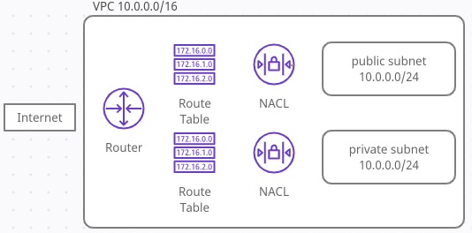
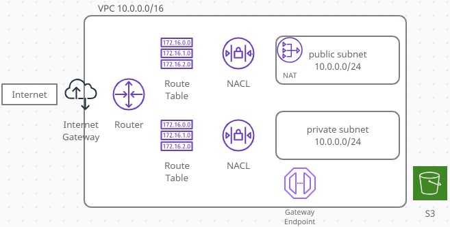

- 게시판 기능
  - 게시글 조회
  - 게시글 등록
  - 게시글 수정
  - 게시글 삭제

- 회원 기능
  - 구글/네이버 로그인
  - 로그인한 사용자 글 작성 권한
  - 본인 작성 글에 대한 권한 관리


<div>
<br>
</div>

- 비즈니스로직 담당
  - Web Controller, Service, Repository, Dto, Domain 5가지 레이어에서 비즈니스 로직 담당:
    - Domain (JPA 방식)
    - Transaction Script방식 (기존방식)
      - @Transactional
      - 모든 로직이 서비스 클래스 내부에서처리

- Spring Bean 주입방식
  - @Autowired (비권장)
  - setter
  - 생성자 (권장) 롬복 @RequiredArgsConstructor

- Entity 클래스를 Request/Response 클래스로 사용 X!
  - 데이터베이스와 맞닿는 핵심 클래스 이므로 변경시 DB문제 발생 가능
  - View Layer와 DB Layer를 구분

- JUnit
  - @WebMvcTest
    - JPA기능 작동하지 않음 -> @SpringBootTest + TestRestTemplate 사용가능
    - 컨트롤러 레이어 테스트 하기 위한 어노테이션
    - 필요한 Mock 오브젝트의 디펜던시를 따로 제공해줘야 함
    - Web(Spring MVC)에 집중
    - @Controller @ControllerAdvice등 와부 연동과 관련된 부분만 활성화
    - @Service @Component @Repository 사용 불가
    - 컨드롤러 기능 테스트할 때 사용
  - @SpringBootTest
    - JPA기능을 함께 테스트할때 TestRestTemplate과 함께 사용하여 기능 테스트
    - 스프링부트가 메인 configuration 클래스(@SpringBootApplication)를 찾아, 스프링 application context를 시작함
    - 어플리케이션 전체를 로그해서 모든빈을 주입하기 때문에 느릴수 있음
    - H2데이터베이스 자동 실행


- h2
  - http://localhost:8081/h2-console
  - jdbc:h2:mem:testdb

- 템플릿 엔진 : 지정된 템플릿과 데이터를 이용하여 HTML 생성
  - 클라이언트 템플릿 엔진 React, Vue
  - 서버 템플릿 엔진
    - JSP, Velocity 권장 X
    - Freemaker
    - Thymeleaf
    - Mustache

- Mustache
  - css는 header, js는 footer (페이지 로딩속도 영향)
  - bootstrap.js는 제이쿼리에 의존 (script 순서 고려하여 배치)

- 쿼리 추가
  - SpringDataJpa에서 제공하지 않는 메소드는 PostsRepository 인터페이스에 추가
  - @Query 어노테이션 사용
  - SpringDataJpa로는 구현하기 힘든 FK조인, 복잡한 조건등을 위해 조회용 프레임워크 추가하여 사용:
    - querydsl (추천- 타입안정성 보장, 래퍼런스 많고, 국내 많은 회사에서 사용중)
    - jooq
    - MyBatis

- REST의 CRUD -> HTTP method 맵핑
  - 생성(Create) - POST
  - 읽기(Read) - GET
  - 수정(Update) - PUT
  - 삭제(Delete) - DELETE


## 스프링 시큐리티와 OAuth 2.0으로 로그인 기능 구현하기

- 스프링 부트 2.0
- 인터셉터, 필터기반의 보안기능 보다 스프링 시큐리티를 통한 구현 권장
- OAuth 로그인시 필요한 구현 기능들 (라이브러리 없이 구현 복잡)
  - 로그인시 보안
  - 비밀번호 찾기
  - 회원가입 시 이메일 혹은 전화번호 인증
  - 비밀번호 변경
  - 회원정보 변경
- 라이브러리: spring-security-oauth2-autoconfigure
- 스프링 부트 2 방식-Spring Security Oauth2 Client 라이브러리
  - 스프링부트 2.0 방식
  - url주소 전부 명시 할 필요 없이 2.0방식에서는 client 인증정보만 입력
  - 기본 제공 enum: CommonOAuth2Provider
  - 이외의 소셜로그인 추가시, 직접 다 추가해야함
```yml
spring:
  security:
    oauth2:
      client:
        clientId: 인증정보
        clientSecret: 인증정보
```

### 구글 로그인

1. 구글 서비스 신규 등록 (clientId, clientSecret 생성, redirect_uri 설정)
  - https://console.cloud.google.com
  - 새 프로젝트 'freelec-springboot2-webservice'
  - API 및 서비스 > 사용자 인증 정보 > 만들기
    - OAuth 클라이언트 ID
    - 동의 화면 구성
      - 애플리케이션 이름: 구글로그인 시 사용자에게 노출할 애플리케이션 이름
      - 고객지원 이메일: 동의화면에 노출될 이메일주소 (e.g. help@myservice.com)
      - Google API 범위(scope) : email,profile,openid 디폴트 이외 추가 가능
    - 애플리케이션 유형: '웹 애플리케이션'
    - 승인된 리디렉션 URI:
      - 'http://localhost:8180/login/oauth2/code/google'
      - '{도메인}/login/oauth2/code/{소셜서비스코드}'
      - AWS 배포시에 도메인 변경하여 추가

2. 프로젝트에 위의 OAuth 정보 등록 (.properties, .yaml)
  - application-oauth 등록
    - src/main/resources/application-oauth.properties
    - `spring.security.oauth2.client.registration.google.client-id=클라이언트ID`
    - `spring.security.oauth2.client.registration.google.client-secret=클라이언트시크릿`
    - `spring.security.oauth2.client.registration.google.scope=profile,email`
    - scope의 openid는 사용하는 서비스와 사용하지 않는 서비스가 있으므로 빼고 scope 등록
  - 스프링부트에서 application-xxx.properties로 만들면 xxx라는 profile이 생성됨
    - application.properties에 다음 추가 `spring.profiles.include=oauth`
  - `.gitignore`에 시크릿키 정보가 올라가지 않도록 다음라인 추가 `application-oauth.properties`

```yaml
spring:
  datasource:
    url: jdbc:h2:mem:testdb
      username: sa
    password:
    driver-class-name: org.h2.Driver

  jpa:
    hibernate:
      ddl-auto: create
    properties:
      hibernate:
        show_sql: true
        format_sql: true
        dialect: org.hibernate.dialect.MySQL5InnoDBDialect
  h2:
    console:
      enabled: true

  profiles:
    include: oauth

logging:
  level:
    org.hibernate.SQL: debug
```

3. User 엔터티
  - 스프링 시큐리티에서 권한코드에 항상 ROLE_ 이 앞에 붙어야 함
  - enum타입 필드 Role의 코드별 키값은 ROLE_xxx 로 지정

4. 스프링 시큐리티 설정 - 라이브러리
   - implementation('org.springframework.boot:spring-boot-starter-oauth2-client')
     - 소셜 로그인 등 클라이언트 입장에서 소셜 기능 구현시 필요한 의존성
     - `spring-security-oauth2-client` 와 `spring-security-oauth2-jose`를 기본적으로 관리해줌
   - SecurityConfig:
     - @EnableWebSecurity
       - @Configuration 클래스에 추가하여 WebSecurityConfigurer에 있는 스프링 시큐리티 설정 활성화
     - 스프링 시큐리티 설정
     - URL별 권한(로그인, 인증여부) 설정
     - lass to have the Spring Security configuration defined in any WebSecurityConfigurer
     - or more likely by extending the WebSecurityConfigurerAdapter base class and overriding individual methods:
   - CustomOAuth2UserService
     - 구글로그인 이후 가져온 사용자정보 (email, name, picture)로 가입, 정보수정, 세션저장 기능 지원
     - loadUser : UserInfo 엔드포인트에서 사용자 attributes를 받아 OAuth2User객체 반환
   - SessionUser
     - SecurityConfig에 User 사용시 다음에러 발생
       - Failed to convert java.lang.Object -> byte[] for value User@4a43d6
       - 직렬화를 구현하지 않았다는 내용의 에러
       - Serialized기능을 엔터티인 User에 추가시 성능등의 문제 발생 가능
       - 따라서 직렬화 기능을 가진 세션 Dto를 하나 추가
     - User 대신 세션 저장용 Dto 클래스 정의

- 컨트롤러에서 응답으로 JPA Entity 대신 DTO 사용 권장
  - [참고링크](https://hjhng125.github.io/jpa/jpa-entity-by-controller/)

- JPA Repository
  - DB Layer 접근자 (MyBatis에서는 흔히 Dao)
  - Entity(Posts)와 Entity Repository (PostsRepository) 함께 위치
  - Entity 클래스는 기본 Repository 없이 제대로 역할 X
  - JpaRepository<엔터티 클래스, PK타입>를 상속하면 기본적인 CRUD 메소드가 자동으로 생성됨
  - @Repository 추가할 필요 X

- @RestController vs @Controller
  - @Controller creates a Map of model object and find a view
  - @RestController simply returns the object and object data is directly written into HTTP response as JSON or XML.
    - Equivalent to @Controller + @ResponseBody

- `@Transactional(readOnly = true)`
```
A boolean flag that can be set to true if the transaction is effectively read-only,
allowing for corresponding optimizations at runtime. Defaults to false.
This just serves as a hint for the actual transaction subsystem;
it will not necessarily cause failure of write access attempts.
A transaction manager which cannot interpret the read-only hint
will not throw an exception when asked for a read-only transaction but rather silently ignore the hint.

```

- 어노테이션 기반으로 코드 개선
  - 어노테이션 정의 @LoginUser
    - 컨트롤러나 메소드에서 세션값(유저정보) 필요할 때 마다 세션정보 호출해야함
    - 메소드인자로 세션 값을 바로 받을 수 있도록 개선: @LoginUser 생성
  - HandlerMethodArgumentResolver 구현체 생성
    - @Component LoginUserArgumentResolver
      - 조건에 맞는 경우 구현체('LoginArgumentResolver')가 지정한 값으로 해당 메소드의 파라미터로 넘길 수있음
        - 컨트롤러 메소드의 특정파라미터를 지원하는지 여부 판단- boolean
        - 파라미터에 전달할 세션객체 생성
        - 스프링에서 LoginUserArgumentResolver를 인식 할 수 있도록 WebMvcConfigurer에 추가: WebConfig
  - WebConfig
    - @Configuration
    - 커스텀 컨트룔러 메소드 argument 타입을 지원하기 위해 @Override addArgumentResolvers
    - addArgumentResolvers를 통해 위에서 정의한 LoginUserArgumentResolver를 추가
    - HandlerMethodARgumentResolver는 항상 WebMvcConfigurer의 addArgumentResolvers()를 통해 추가


- `@Component` 어노테이션
  - https://www.baeldung.com/spring-component-annotation
  - Spring ApplicationContext
    - 스프링이 관리하고/자동 분배되도록 설정한 객체(beans) 인스턴스들을 저장하는 곳
    - 스프링 빈관리와 디펜던시 인젝션 옵션은 스프링의 주기능
    - IOC를 통해, 어플리케이션의 빈 인스턴스들을 수집하여 적절한 시간에 사용
    - @Autowired 등의 어노테이션으로 스프링관리 빈을 애플리케이션에 주입하는것은 powerful,scalable한 코드를 만드는 힘
    - 클래스에 stereotype 어노테이션을 사용하여 스프링의 자동 bean dectection 활용
  - @Component는 스프링이 우리가 커스텀 정의한 빈을 detect할 수 있게 함

- `@Configuration` 어노테이션
  - 스프링 어노테이션 기반 configuration 설정에 사용됨
  - 해당 어노테이션이 있는 클래스는 1개이상의 @Bean 메소드를 선언하며
  - 스프링 컨테이너에 의해 프로세스 되어 빈 definition과 런타임에 빈에 대한 서비스 리퀘스트를 생성함

- 세션저장소로 데이터베이스 사용하기
  - 애플리케이션 재실행시 내장톰캣에 있는 세션정보가 없어져서 로그아웃됨
  - WAS가 여러대라면 서로간에 세션동기화가 필요. 현업에서의 해결책:
  1. 톰캣세션
  2. MySQL과 같은 데이터베이스를 세션저장소로 사용
     - spring-session-jdbc 등록: gradle 디펜던시
     - implementation('org.springframework.session:spring-session-jdbc')
     - spring.session.store-type=jdbc
     - SPRING_SESSION, SPRING_SESSION_ATTRIBUTES 테이블이 JPA에 의해 생성되고 여기서 세션이 저장됨
     - 물론 스프링부트 재시작시 DB-h2도 재시작되므로 세션도 초기화 됨: AWS RDS사용시 문제 없음
  3. Redis, Memcached와 같은 메모리 DB를 세션저장소로 사용
    - B2C에서 많이 사용
    - ElastiCache는 비용발생함


### 네이버 로그인

1. 네이버 서비스 신규등록
   - https://developers.naver.com/apps/#/register?api=nvlogin
   - freelec-springboot2-webservice
   - 서비스url http://localhost:8180/
   - 네이버로그인 콜백url http://localhost:8180/login/oauth2/code/naver
     - '{도메인}/login/oauth2/code/{소셜서비스코드}'
     - 구글의 리디렉션 URL과 같은 역할

  - 네이버로그인 응답결과
    - 네이버는 기준이되는 user_name의 이름을 response로 해야함
    - `spring.security.oauth2.client.provider.naver.user-name-attribute=response`
    - 스프링 시큐리티에서는 하위필드를 명시 할 수 없기 떄문에, 최상위 필드들만 user_name으로 지정가능
    - 네이버 응답값 최상위 필드들: resultCode, message, response
    - 본문에서 담고있는 response를 user_name으로 지정하고 이후 자바코드로 response의 id를 user_name으로 지정
```json
{
  "resultCode": "00",
  "message": "success",
  "response": {
    "email": " openapi@naver.com",
    "nickname": "OpenAPI",
    "profile_image": "...",
    "age": "40-49",
    ...
    
  }
}
```

- 테스트 에러 디버깅
  - No qualifying bean of type `com.spring.book.springboot.config.auth.CustomOAuth2UserService`
    - @SpringBootTest 에서 발생
    - CustomOAuth2UserService 생성하는데 필요한 소셜로그인 관련 설정값들이 없기 때문
    - 다만 test에 application.properties 가 없으면 디폴트로 main에서 가져옴
    - 자동으로 가져오는 범위는 application.properties 까지임
    - 테스트환경을 위한 application-oauth.properties 생성
  - `<302 FOUND>` (리다이렉션 응답) 에러
    - 인증되지 않은 사용자의 요청은 이동시킴
    - 임의로 인증된 사용자를 추가하여 API 기능 테스트 `@WithMockUser(roles="USER")`
    - Gradle 디펜던시도 testImplementation에 추가
      - `testImplementation 'org.springframework.security:spring-security-test'`
  - No qualifying bean of type `com.spring.book.springboot.config.auth.CustomOAuth2UserService`
    - @WebMvcTest 에서 발생
    - 스프링시큐리티 설정(properties)은 잘작동 했지만 CustomOAuth2UserService 스캔하지 않음
    - @WebMvcTest는 컨트롤러 및 컨트롤러어드바이스 등을 읽지만 @Repository, @Service, @Component는 스캔대상이 아님
    - 따라서 SecurityConfig는 읽었지만 이를 생성하기 위해 필요한 CustomOAuth2UserService는 읽지못함
    - 스캔대상에서 SecurityConfig 제거하여 해결: `@WebMvcTest의 excludeFilters` 추가
    - @WithMockUser도 추가
  - 위의 에러 해결 후 IllegalArgumentException
    - `JPA metamodel must not be empty` (또는 `At least one JPA metamodel must be present`)
    - @EnableJpaAuditing 사용하려면 최소한 하나의 @Entity 클래스 필요
    - @WebMvcTest이다 보니 당연히 없음
    - @EnableJpaAuditing가 @SpringBootApplication와 함께 있다보니, @WebMvcTest에서도 스캔
    - Application.java에서 @EnableJpaAuditing 제거 후 JpaConfig 클래스 별도로 생성


- 서버 구동방법
  - 가정용 서버 (PC, NAS)
  - 호스팅서비스 (Cafe24, 코리아호스팅)
  - 클라우드서비스 (AWS, AZURE, GCP)

- 클라우드 서비스의 종류
  - IaaS
  - PaaS
  - SaaS


## AWS 환경 구축


- VPC
  - CIDR 10.0.0.0/16
  - 라우팅테이블, NACL, 보안그룹이 함께 자동 생성됨
- 서브넷
  - 퍼블릭 10.0.0.0/24
  - 프라이빗 10.0.1.0/24



- 인터넷 게이트웨이
  - 생성 후 'detached' -> VPC 연결

- 라우팅 테이블
  - 프라이빗 freelec-private-rt
    - VPC생성시 디폴트 RT를 프라이빗으로 사용
    - 서브넷연결 : 명시적연결이 없는 서브넷(퍼블릭 & 프라이빗) 기본 퍼블릭 RT에 연결되어 있음
    - 라우팅 10.0.0.0/16	local (외부로부터 막힘)
  - 퍼블릭 freelec-public-rt
    - 서브넷연결: 퍼블릭 서브넷
    - 라우팅 10.0.0.0/16	local (외부로부터 막힘)
    - 라우팅 인터넷게이트웨이 igw추가 (10.0.0.0/16이외 모든 ip는 igw로)
- NACL
  - 프라이빗: VPC생성 시 디폴트
    - 서브넷연결 설정
  - 퍼블릭
    - 서브넷연결 설정 - 인바운드규칙 번호 오름차순으로 순서대로 확인
  - 아웃바운드 1024-65535 응답시 임시포트 범위중 선택

- EC2
  - 인스턴스 시작 (바스티온) > 인스턴스 세부정보 구성
    - (사전작업) 퍼블릭 서브넷 > 작업 > 서브넷설정 편집 > 퍼블릭 IPv4 주소 자동 할당 활성화
    - 퍼블릭
      - SG 생성 (모든포트)
    - 프라이빗
      - SG 생성
        - SSH 22 소스: 퍼브릭SG만 허용
        - ICMP 모든 포트 소스: 퍼브릭SG만 허용
      - IAM 역할 s3_fullaccess 선택 (엔드포인트 서비스 사용을 위한 IAM > '역할' 생성 필요)
    - 고급세부정보
```sh
#!/bin/bash
yum install httpd -y
service httpd start
```

- NAT 게이트웨이
  - NAT 게이트웨이로 프라이빗 EC2에 mysql 설치하기
  - 생성 > '퍼블릭' 서브넷 선택
  - 탄력적 IP 할당
  - 프라이빗 EC2 내에서 `sudo yum install` 여전히 안됨
  - '프라이빗' RT 라우팅 테이블 설정 추가필요
    - 서브넷 > 라우팅 > 라우팅 편집
      - 0.0.0.0/16 local
      - 0.0.0.0/0 생성한 NAT 게이트웨이 추가
  
- VPC 게이트웨이 엔드포인트
  - 프라이빗 EC2를 위한 서비스 : AWS 서비스(S3, ...) 에 대한 접근 제공
  - NAT 게이트웨이를 통해서 액세스할수도 있지만, 트래픽 노출의 위험이 있음
  - IAM S3 접근 권한 부여해줘야함 > 역할만들기 > 사용사례 EC2 > 권한정책 'AmazonS3FullAccess'
    - 프라이빗 EC2 생성시에 '역할'에 지정
  - S3 버킷생성 (버킷명: 'vpc-endpoint-check')
  - 프라이빗 EC2에서 S3접근 가능한지 테스트
    - AWS계정에 있는 S3버킷 확인 `aws s3 ls --region ap-northeast-2`
    - VPC 게이트웨이 엔드포인트 설정 안했는데도 접근됨!
    - NAT 게이트웨이를 설정 해줬기 때문: 프라이빗 RT > 라우팅편집 > NAT 게이트웨이 라우팅 제거
    - NAT 게이트웨이 라우팅 삭제 후 접근 안됨!
    - 연결하기 위해 VPC 엔드포인트 생성:
      - VPC > 엔드포인트 > 생성
        - 서비스: com.amazonaws.ap-northeast-2.s3	'Gateway' 선택
        - VPC: freelec VPC선택
        - RT: 프라이빗 선택
      - 프라이빗 RT에 '엔드포인트' 로우가 한개 자동으로 추가됨
        - S3와 관련된 트래픽이 오면 S3로 보내게 됨
      - VPC엔드포인트 외에 NAT 게이트웨이도 별도로 추가가능: 프라이빗 RT > 라우팅 편집
        - 10.0.0.0/16은 로컬, 이외 S3관련된건 엔드포인트타고 S3로, 이외는 NAT 게이트웨이
       



```
* 바스티온 호스트 vs NAT 게이트웨이: 상반된 목적
- 바스티온 호스트: 외부인터넷 -> 프라이빗 서브넷
- NAT 게이트웨이: 프라이빗 서브넷 -> 외부인터넷
```


```shell
# 자바 패키지 검색
# yum search java-1.8 | grep Development
# java-1.8.0-openjdk-devel.x86_64 : OpenJDK 8 Development Environment

# 자바 8 설치
sudo yum install java-1.8.0-openjdk-devel.x86_64
sudo update-alternatives --config java

# 타임존 UTC -> KST
sudo rm /etc/localtime
sudo ln -s /usr/share/zoneinfo/Asia/Seoul /etc/localtime

# 깃설치 및 소스다운로드
sudo yum install git
mkdir ~ec2-user/app && mkdir ~ec2-user/app/step1
cd ~ec2-user/app/step1
git clone https://github.com/jojoldu/freelec-springboot2-webservice.git
cd freelec-springboot2-webservice

# 그래들로 테스트코드 실행하여 코드동작 확인
# chmod +x ./gradlew
./gradlew test
cd ~ec2-user/app/step1
touch deploy.sh
```

- 배포스크립트 `deploy.sh`

```shell
#!/bin/bash
REPOSITORY=/home/ec2-user/app/step1
PROJECT_NAME=freelec-springboot2-webservice

cd $REPOSITORY/$PROJECT_NAME/
echo "> Git Pull"
git pull

# 프로젝트 빌드하기
echo "> 프로젝트 Build 시작"
./gradlew build

echo "> step1 디렉토리로 이동"
cd $REPOSITORY

echo "> Build 파일 복사"
cp $REPOSITORY/$PROJECT_NAME/build/libs/*.jar $REPOSITORY/

echo "> 현재 구동 중인 애플리케이션 pid 확인"

CURRENT_PID = $(pgrep -f ${PROJECT_NAME}.*.jar)

echo "> 현재 구동 중인 애플리케이션 pid: $CURRENT_PID"

if [ -z "$CURRENT_PID" ]; then
  echo "> 현재 구동 중인 애플리케이션이 없으므로 종료하지 않습니다."
else
  echo "> kill -15 $CURRENT_PID"
  kill -15 $CURRENT_PID
  sleep 5
fi

echo "> 새 애플리케이션 배포"
JAR_NAME=$(ls -tr $REPOSITORY/ | grep jar | tail -n 1)
echo "> JAR Name: $JAR_NAME"
nohup java -jar $REPOSITORY/$JAR_NAME 2>&1 &
```
