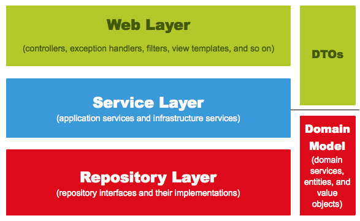

- 게시판 기능
  - 게시글 조회
  - 게시글 등록
  - 게시글 수정
  - 게시글 삭제

- 회원 기능
  - 구글/네이버 로그인
  - 로그인한 사용자 글 작성 권한
  - 본인 작성 글에 대한 권한 관리

 

- 비즈니스로직 담당
  - Web Controller, Service, Repository, Dto, Domain 5가지 레이어에서 비즈니스 로직 담당:
    - Domain (JPA 방식)
    - Transaction Script방식 (기존방식)
      - @Transactional
      - 모든 로직이 서비스 클래스 내부에서처리

- Spring Bean 주입방식
  - @Autowired (비권장)
  - setter
  - 생성자 (권장) 롬복 @RequiredArgsConstructor

- Entity 클래스를 Request/Response 클래스로 사용 X!
  - 데이터베이스와 맞닿는 핵심 클래스 이므로 변경시 DB문제 발생 가능
  - View Layer와 DB Layer를 구분

- JUnit
  - @WebMvcTest
    - Web(Spring MVC)에 집중
    - @Controller @ControllerAdvice등 와부 연동과 관련된 부분만 활성화
    - @Service @Component @Repository 사용 불가
    - 컨드롤러 기능 테스트할 때 사용
    - JPA기능 작동하지 않음
  - @SpringBootTest
    - H2데이터베이스 자동 실행
    - JPA기능을 함께 테스트할때 TestRestTemplate과 함께 사용하여 기능 테스트

- h2
  - http://localhost:8081/h2-console
  - jdbc:h2:mem:testdb

- 템플릿 엔진 : 지정된 템플릿과 데이터를 이용하여 HTML 생성
  - 클라이언트 템플릿 엔진 React, Vue
  - 서버 템플릿 엔진
    - JSP, Velocity 권장 X
    - Freemaker
    - Thymeleaf
    - Mustache