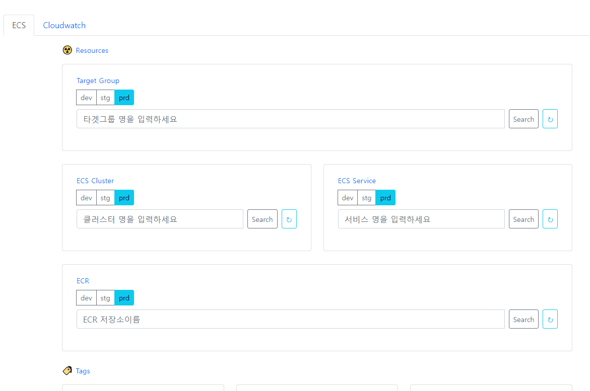

- Go AWS Sdk
  - https://github.com/jnuho/goproject
  - 주요기능 : 
    - https://aws.amazon.com/sdk-for-go/
    - ALB/NLB -> TargetGroup -> ECS/EC2 자원 조회
    - ECS 자원 상세조회 : 각 Task내의 Container 및 이미지, IP 정보 상세조회
    - ECR 이미지 : Tag 및 이미지 uri 조회 최신 순 조회
  - 구현 시 고려사항 :
    - AWS 자원간에 의존성 있는데, API에서 조회 결과로 복잡한 의존관계를 한번의 호출로 조회할 수 없음
    - 의존 관계에 있는 각 자원 API 호출하여 Go언어로 데이터를 가공하여 결과 얻음
  - 사용언어 :
    - 백엔드: Go, 프론트엔드: Javascript, HTML, CSS




- Aws Profile 관리

```go
import "github.com/aws/aws-sdk-go/aws/session"

// 세션객체 초기화
func InitSession(profile string) *session.Session {
	if profile == "dev" {
		profile = awsProfile.dev
	} else if profile == "stg" {
		profile = awsProfile.stg
	} else if profile == "prd" {
		profile = awsProfile.prd
	}
  sess, err := session.NewSessionWithOptions(session.Options{
    // Specify profile to load for the session's config
    Profile: profile,
    SharedConfigState: session.SharedConfigEnable,
  })
  if err != nil {
    panic(err)
  }
  return sess
}

```

- 구조체 Repo 정의
- Repo 반환 인터페이스 정의
- Repo 구조체 구현 메소드 정의
  - func (repo *Repo) getAWSTargetGroups()
  - func (repo *Repo) getAWSTargetHealths(tgarn string)
  - func (repo *Repo) getAWSEcsClusterDetails(clusterArn string)
  - func (repo *Repo) getAWSEcsSvcList(clusterArns []*string)
  - func (repo *Repo) getAWSListClusters()
  - func (repo *Repo) getAWSEcsClusters(clusters []*string)
  - func (repo *Repo) getAWSEcsDescribeTaskDefinition(services []*ecs.Service)
  - func (repo *Repo) getAWSEcsListAndDescribeTasks(clusterName, serviceName string)
  - func (repo *Repo) getAWSEcsDescribeService(clusterName, serviceName string)
  - func (repo *Repo) getAWSEcrRepos(repoName string)
  - func (repo *Repo) getAWSEcrDescribeImages(repoUri, repoName string)
  

```go
// 세션 리포지토리
type Repo struct {
  sess *session.Session
}

// 세션 리포지토리 인터페이스
func RepoInterface(param *session.Session) *Repo {
  return &Repo{sess: param}
}

/**
 * 세션 리포지토리 Repo 구현체
 */

// TG 조회 -> tgMap 저장
func (repo *Repo) getAWSTargetGroups() {

  // 데이터 초기화
  tgMap = make(map[string]*elbv2.TargetGroup)

  // ELBV2 서비스 생성
  svc := elbv2.New(repo.sess)
  input := &elbv2.DescribeTargetGroupsInput{ // 요청 파라미터
    Names: []*string {
      // aws.String("awsdc-tg-erp-dev-tdms-7080"),
    },
  }
  // ELBV2 서비스 api DescribeTargetGroups 호출
  pageNum := 0
  // result, err := svc.DescribeTargetGroups(input)
  err := svc.DescribeTargetGroupsPages(input, func(page *elbv2.DescribeTargetGroupsOutput, lastPage bool) bool {
      pageNum++
      log.Println("PAGE result data size: ", len(page.TargetGroups))
      for _, tg := range page.TargetGroups {
        tgMap[*tg.TargetGroupName] = tg
      }
      return !lastPage
  })
  if err != nil {
    handleError(err)
    return
  }
}

```
