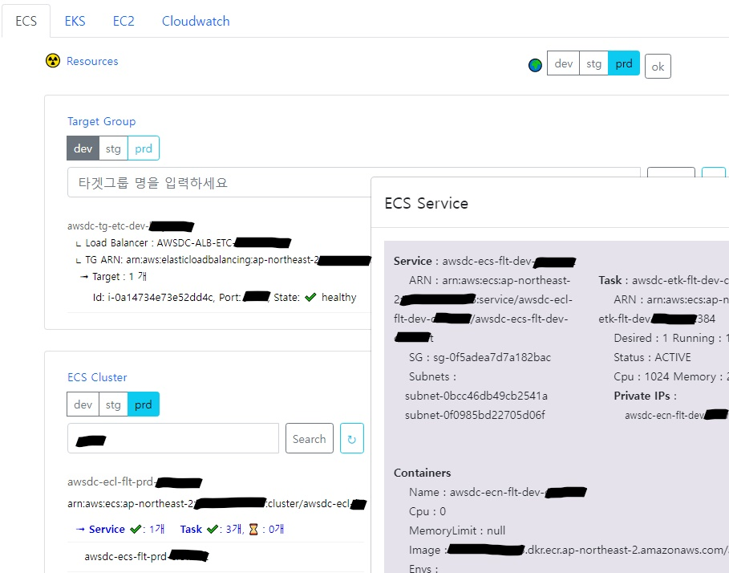

- AWS 자원 조회
	- [영문 Ver.](doc_goproject)

- 진행 배경
	- 최근 EC2 -> ECS 이관 및 생성 작업이 많아 지면서 ECS 자원조회에 중점을 두고 진행
- 사용 기술
	- 프론트엔드 : Javascript, HTML, CSS
	- 백엔드 : Go언어, Go AWS SDK 라이브러리
- 주요 기능
	- TG 조회 : ALB -> TG -> Target 자원 상태(health) container-ip / instance-id 조회
	- ECS 조회 : 각 Task내의 Container 및 이미지, IP 정보 상세조회
	- ECR : Tag 및 이미지 uri 조회 -> Go활용한 최신 순 정렬
- 구현 시 고려사항 :
	- CLI(go cobra library)로 구현하려고 했으나 cmd창을 열어 타이핑하는 작업은 오히려 불편하다고 생각하여,
	- 웹페이지 url (ip:port)로 간편하게 사용할 수 있도록 구현방법 수정
		- 해당 url은 프라이빗 클라우드 내부 vpn으로만 접근 가능
	- AWS 자원간 의존성이 있는데, AWS가 제공하는 단일 API로 원하는 자원상태 조회가 힘듦
	- 자원 조회 API를 여러개 호출하여 Go언어로 조회 데이터 manipulate 및 정렬 처리하여 보기쉽게 화면출력
- 진행 상태
	- 확장성이 있는 어플리케이션이기 때문에, 추후 로그 조회, EC2, EKS 조회 등의 기능도 언제든지 추가가능
- 테스트
	- Cloud접속 > http://oo.oo.oo.ooo:port 기능 사용




- Aws Profile 관리

```go
import "github.com/aws/aws-sdk-go/aws/session"

// AWS 프로파일 명 (~/.aws/config)
type AwsProfile struct{
	dev string
	stg string
	prd string
}
var awsProfile AwsProfile

// 세션객체 초기화
func InitSession(profile string) *session.Session {
	if profile == "dev" {
		profile = awsProfile.dev
	} else if profile == "stg" {
		profile = awsProfile.stg
	} else if profile == "prd" {
		profile = awsProfile.prd
	}
	sess, err := session.NewSessionWithOptions(session.Options{
		// Specify profile to load for the session's config
		Profile: profile,
		SharedConfigState: session.SharedConfigEnable,
	})
	if err != nil {
		panic(err)
	}
	return sess
}
```

- 구조체 Repo 정의
- Repo 반환 인터페이스 정의
- Repo 구조체 구현 메소드 정의
	- `func (repo *Repo) getAWSTargetGroups()`
	- `func (repo *Repo) getAWSTargetHealths(tgarn string)`
	- `func (repo *Repo) getAWSEcsClusterDetails(clusterArn string)`
	- `func (repo *Repo) getAWSEcsSvcList(clusterArns []*string)`
	- `func (repo *Repo) getAWSListClusters()`
	- `func (repo *Repo) getAWSEcsClusters(clusters []*string)`
	- `func (repo *Repo) getAWSEcsDescribeTaskDefinition(services []*ecs.Service)`
	- `func (repo *Repo) getAWSEcsListAndDescribeTasks(clusterName, serviceName string)`
	- `func (repo *Repo) getAWSEcsDescribeService(clusterName, serviceName string)`
	- `func (repo *Repo) getAWSEcrRepos(repoName string)`
	- `func (repo *Repo) getAWSEcrDescribeImages(repoUri, repoName string)`

```go
// 세션 리포지토리
type Repo struct {
	sess *session.Session
}

// 세션 리포지토리 인터페이스
func RepoInterface(param *session.Session) *Repo {
	return &Repo{sess: param}
}

/**
 * 세션 리포지토리 Repo 구현체
 */

// TG 조회 -> tgMap 저장
func (repo *Repo) getAWSTargetGroups() {

	// 데이터 초기화
	tgMap = make(map[string]*elbv2.TargetGroup)

	// ELBV2 서비스 생성
	svc := elbv2.New(repo.sess)
	input := &elbv2.DescribeTargetGroupsInput{ // 요청 파라미터
		Names: []*string {
			// aws.String("awsdc-tg-erp-dev-tdms-7080"),
		},
	}
	// ELBV2 서비스 api DescribeTargetGroups 호출
	pageNum := 0
	// result, err := svc.DescribeTargetGroups(input)
	err := svc.DescribeTargetGroupsPages(input, func(page *elbv2.DescribeTargetGroupsOutput, lastPage bool) bool {
			pageNum++
			log.Println("PAGE result data size: ", len(page.TargetGroups))
			for _, tg := range page.TargetGroups {
				tgMap[*tg.TargetGroupName] = tg
			}
			return !lastPage
	})
	if err != nil {
		handleError(err)
		return
	}
}

```

