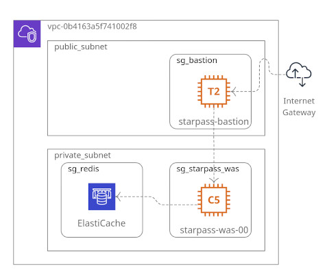

<!--  -->


<!--  -->



- 같은 VPC 공유:
  - ElastiCache 클러스터
  - EC2 starpass-was-00
  - EC2 starpass-bastion

### VPC
- VPC : CIDR 172.20.0.0/16
  - e.g. 172.20.0.0 ~ 172.20.255.255


### 인터넷게이트웨이
- VPC에 Attach

### 서브넷, 라우트테이블
- 퍼블릭
  - 서브넷 : CIDR 172.20.0.0/24 (현재는 VPC 내 로컬에서만 접근 가능-private)
  - 라우트테이블
  - '라우트' 탭 > 추가 '0.0.0.0/0', 'igw-071ed7e5e7b2b8385'
  - '서브넷연결' 탭 > 위의 서브넷 연결하여 퍼블릭으로 만듦

- 프라이빗
  - 서브넷 : CIDR 172.20.1.0/24
  - 라우트테이블
    - '서브넷연결' 탭 > 위의 서브넷 연결하여 프라이빗으로 만듦

### 보안그룹
- EC2용
  - SG (TCP port 6379 open) with a VPC above for ElastiCache cluster

- ElastiCache용
  - ElastiCache : with SG above && create subnetgroup that uses same VPC as above
  - EC2 : with a new SG with inbound port 22 for SSH

### EC2
- 퍼블릭 IP자동할당 : 'Enable'
- 다음 커멘드 라인으로 redis클라이언트 설치

```sh
# Linux in general
wget http://download.redis.io/redis-stable.tar.gz
tar -xvzf redis-stable.tar.gz
cd redis-stable
make && make install
redis-cli -h {ElastiCache_Endpoint} -p {port configured in SG above;6379}

# Ubuntu
sudo apt update
sudo apt install redis

> flushall
> keys *
```


### ElastiCache-redis 생성
- 서브넷그룹은 위에서 생성된 VPC, 퍼블릭서브넷을 선택

### 테스트
- 위의 VPC, 퍼블릭서브넷으로 생성된 EC2에서만 ElasticCache접근 확인
- 다른 VPC 또는 프라이빗서브넷으로 생성된 EC2에서는 접근 불가
