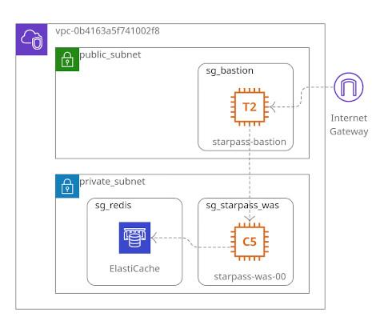

junho-rowem 2021-08-19

- 인프라 OverView
  - 같은 VPC 내에, 퍼블릭/프라이빗 서브넷으로 구분
  - 캐시 클러스터 미생성 상태. 보안그룹은 생성되어 있음(인바운드 6379)
  - 클러스터 생성 시 VPC, 서브넷그룹 선택
    - VPC: EC2와 같은 VPC 선택
    - [서브넷그룹](https://docs.aws.amazon.com/AmazonElastiCache/latest/red-ug/SubnetGroups.html): 프라이빗 서브넷 선택 



- 인프라 구축 테스트
  1. [VPC](#vpc)
  2. [인터넷 게이트웨이](#인터넷-게이트웨이)
  3. [서브넷, 라우팅 테이블](#서브넷-라우팅-테이블)
  4. [보안 그룹](#보안-그룹)
  5. [EC2](#ec2)
  5. [ElastiCache](#elasticache)

#### VPC
- CIDR 172.20.0.0/16

#### 인터넷 게이트웨이
- VPC에 Attach

#### 서브넷, 라우팅 테이블
- 퍼블릭
  - 서브넷 : CIDR 172.20.0.0/24
  - 라우트테이블 - 생성한 인터넷 게이트웨이 추가 및 퍼브릭 서브넷 연결

- 프라이빗
  - 서브넷 : CIDR 172.20.10.0/23
  - 라우트테이블 - 프라이빗 서브넷 연결

#### 보안 그룹
같은 VPC내 보안 그룹 구분

- sg-bastion
  - 인바운드: SSH 오피스ip:22

- sg-starpass-was
  - 인바운드: sg-bastion:22

- sg-starpass-redis
  - 인바운드: sg-was/web/bastion:6379


#### EC2
- starpass-was-00에 redis클라이언트 설치

```sh
# 리눅스 in general
wget http://download.redis.io/redis-stable.tar.gz
tar -xvzf redis-stable.tar.gz
cd redis-stable
make && make install

# 우부투 환경
sudo apt update
sudo apt install redis

# 접속 시도
redis-cli -h {ElastiCache 엔드포인트} -p {보안그룹에 정의된 포트 6379}

> flushall
> keys *
```

#### ElastiCache
- redis 선택
- 노드유형: r5,m5,r4,m4,r3,m3,t3,t2 메모리 및 네트워크 성능 선택
- 서브넷그룹 '생성' starpass-was-00, starpass-bastion와 같은 VPC, 프라이빗 서브넷 선택
- 보안그룹 sg-starpass-redis 선택 
- 자동 백업 활성화 체크해제


#### 테스트
- ElastiCache접근은 보안그룹에 인바운드 규칙에 정의된 호스트 이외 ip에서는 접근 불가
- 스프링 환경에서 jedis를 접근가능 한지 여부 확인하기 위해, 해당 EC2에서 redis-cli로 접속 테스트
- EC2환경에 아파치서버 구동하여 캐시저장 조회 테스트 필요
