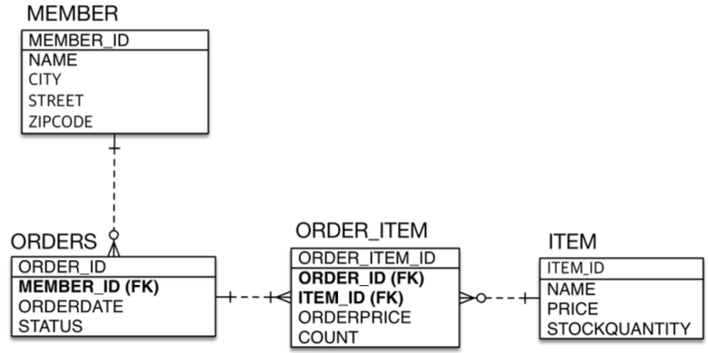

- [2. JPA 시작](#2-JPA-시작)
- [3. 영속성 관리](#3-영속성-관리)
- [4. 앤티티 매핑](#4-앤티티-매핑)
- [5. 연관관계 매핑 기초](#5-연관관계-매핑-기초)
- [6. 다양한 연관관계 매핑](#6-다양한-연관관계-매핑)
- [7. 고급 매핑](#7-고급-매핑)
- [8. 프록시와 연관관계 관리](#8-프록시와-연관관계-관리)
- [9. 값 타입](#9-값-타입)

### 2. JPA 시작

- 객체답게 모델링 할수록 매핑작업만 늘어남 (MyBatis) -> JPA도입
  - 객체를 자바 컬렉션에 저장하듯이 DB에 저장하는 JPA
  - Java Persistence API (자바 진영의 ORM 기술 표준)
  - `jpa.persist(member);`
  - `Member member = jpa.find(memmberId);`
  - `member.setName("변경힐 이름");`
  - `jpa.remove(member);`

- New Project > Java, Maven
- GroupId : jpa-basic
- Artifact : ex1-hello-jpa
- Dependencies (pom.xml)
  - JPA 하이버네이트
  - H2 데이터베이스
- src > main > resources > META-INF 디렉토리 > persistence.xml 생성

- pom.xml

```xml
<dependencies>
    <!-- JPA 하이버네이트 -->
    <dependency>
        <groupId>org.hibernate</groupId>
        <artifactId>hibernate-entitymanager</artifactId>
        <version>5.3.10.Final</version>
    </dependency>
    <!-- H2 데이터베이스 -->
    <dependency>
        <groupId>com.h2database</groupId>
        <artifactId>h2</artifactId>
        <version>1.4.199</version>
    </dependency>
</dependencies>
```

- h2 200 버전 다운로드 https://h2database.com/h2-2019-10-14.zip
  - jdbc:h2:~/test 커넥트
  - jdbc:h2:tcp://localhost/~/test 커넥트
  - 테이블생성

```sql
CREATE TABLE MEMBER (
  id bigint not null,
  name varchar(255),
  primary key (id)
);
SELECT * FROM MEMBER;
```

### 3. 영속성 관리

```java
package hello.jpa;

import javax.persistence.Entity;
import javax.persistence.Id;

@Entity
public class Member {
	@Id
	private Long id;
	private String name;
	// getter, setter
```

- Persistence 설정정보 -> EntityManagerFactory -> EntityManager
  - emf: 웹서버 올라오는 시점에 1개 객체 생성됨 (싱글톤)
  - em: 생성/삭제 반복: thread 공유 하면 안됨!
  - JPA 모든 변경은 트랜젝션 안에서

- JPQL
  - 단순조회 EntityManager.find() 또는 객체그래프 탐색 a.getB().getC()
  - 복잡한 세부조건 where절 사용하기 위해 JPQL 사용
  - JPQL은 엔티티 객체를대상으로 쿼리
  - SQL은 데이터베이스 테이블을 대상으로 쿼리

- 핵심 2가지
  - 객체와 관계형 데이터베이스 매핑하기 (Object Relational Mapping)
  - 영속성 컨텍스트

- 영속성 컨텍스트
  - 엔티티를 (영속성 컨텍스트에) 영구 저장하는 환경 EntityManager.persist(entity);
  - 영속성 컨텍스트는 논리적인 개념. 엔티티매니저를 통해서 영속성 컨텍스트에 접근
  - EntityManager - PersistentContext 1:1
  - 엔티티 생성주기
    - 비영속 new/transient
    - 영속 managed : em.persist(member);
    - 준영속 detached : em.detach(member);
    - 삭제 removed : em.remove(member);
  - 애플리케이션과 DB 사이 중간에 영속성 컨텍스트 : (버퍼링, 캐싱 등 이점 있음)
  - 엔티티 조회, 1차캐시 key,value = (@Id, Entity 객체) 에서 조회, 반환
  - 1차캐시에 없으면 -> DB 조회 후 -> 1차 캐시에 저장 -> 객체 반환
  - DB 트랜젝션끝나면 entityManager는 사라지기때문에 1차캐시의 큰 성능적 이점은 없음

```java
package hello.jpa;

import javax.persistence.EntityManager;
import javax.persistence.EntityManagerFactory;
import javax.persistence.EntityTransaction;
import javax.persistence.Persistence;
import java.util.List;

public class JpaMain {
	public static void main(String[] args) {
		// persistence.xml에 정의된 hello 설정정보 가져옴
		EntityManagerFactory emf = Persistence.createEntityManagerFactory("hello");
		EntityManager em = emf.createEntityManager();

		EntityTransaction tx = em.getTransaction();
		tx.begin();
		try {
			// 1. Create 등록

			// 비영속
//			Member member = new Member();
//			member.setId(1L);
//			member.setName("HelloA");
			//	영속 DB쿼리는 아직-> commit(); 시점에 INSERT 됨
			// 1차캐시에 저장됨
//			em.persist(member);
			// 비슷한 방식으로 select 를 할때도 DB 조회후에 1차캐시에 저장!
			//  -> 2번째 조회시에는 1차캐시에서 가져옴

			// 2. Read 조회
			// 1차캐시에서 조회함 : 쿼리 select 쿼리 안나감(1차캐시)
//			Member findMember = em.find(Member.class, 1L);
//			System.out.println("findMember.Id=" + findMember.getId());
//			System.out.println("findMember.Name=" + findMember.getName());
			List<Member> result = em.createQuery("select m from Member as m", Member.class)
					.setFirstResult(5) // 5번 부터
					.setMaxResults(8)  // 8개 데이터
					.getResultList();
			for (Member m : result) {
				System.out.println("member.name = " + m.getName());
			}

			// 3. Update 수정
			Member findMember = em.find(Member.class, 1L);
			findMember.setName("HelloJPA");
			// em.persist(member); 필요없음! 마치 컬렉션에 저장하는것 같음
			// -> UPDATE쿼리 tx.commit(); 시점에 발생!

			// 4. Delete 삭제
//			em.remove(findMmeber);

			// 커밋!
			tx.commit();

		} catch(Exception e) {
			tx.rollback();
		} finally {
			em.close();
		}

		emf.close();
	}
}
```

- 영속 엔티티의 동일성 보장
  - Member a = em.find(Member.class, "member1");
  - Member b = em.find(Member.class, "member1");
  - a==b (1차캐시에서 가져 옴. 같은 트랜젝션에서만 가능)

- 엔티티등록: 트랜젝션을 지원하는 쓰기지연 (버퍼링)
  - em.persist(member); 이때는 INSERT 안하고, tx.commit();시에 INSERT 쿼리 실행
  - tx.commit(); -> flush
  - JDBC 배치 : persistence.xml "`hibernate.jdbc.batch_size" 버퍼사이즈 설정

- 엔티티 수정 변경 감지
  - 1차캐시에 @Id, Entity, 스냅샷 있음.
  - tx.commit(); 데이터 업데이트 시 앤티티와 스냅샷 비교 후 쓰기지연 업데이트 SQL -> DB실행

```java
  // 3. Update 수정
  Member findMember = em.find(Member.class, 1L);
  findMember.setName("HelloJPA");
  // em.persist(member); 필요없음! 마치 컬렉션에 저장하는것 같음
  // -> UPDATE쿼리 tx.commit(); 시점에 발생!
```

- 플러시 : 영속성 컨텍스트의 변경내용을 데이터베이스에 반영
  - 변경감지-> 수정된 엔티티 쓰기지연 SQL저장소에 등록
  - 쓰기지연 SQL 저장소의 쿼리를 데이터베이스에 전송 (등록, 수정, 삭제 쿼리)

- 영속성 컨텍스트를 플러시 하는방법
  - em.flush() 직접 플러시 호출 (tx.commit(); 하기전에 강제로 DB반영)
  - tx.commit() 자동 플러시 호출
  - JPQL 쿼리실행 자동 플러시 호출. em.persist()하고 tx.commit()전에 JPQL(select)하는 경우. flush() 호출

- 플러시 모드 옵션
  - em.setFlushMode(FlushModeType.COMMIT); // 커밋할때만 플러시
  - em.setFlushMode(FlushModeType.AUTO); // 커밋이나 쿼리를 실행할 때 플러시 (기본값)


- 준영속 상태
  - 영속(1차캐시에 들어가서 JPA가 관리하는 상태) -> 준영속
  - 영속상태 엔티티가 영속성 컨텍스트에서 분리(detached)
  - 영속성 컨텍스트가 제공하는 기능을 사용하지 못함
  - em.detach(entity) 특정 엔티티만 준영속 상태로 전환
  - em.clear() 영속성 컨텍스트를 완전히 초기화
  - em.close() 영속성 컨텍스트를 종료

```java
Member m = em.find(Member.class, 150L);
m.setName("AAA");
em.detach(m);

// 아무일도 일어나지 않음(detach되어서 JPA가 관리하지 않기 때문)
// select쿼리만 나오고 insert는 실행안됨
tx.commit();
```


### 4. 앤티티 매핑

- @Entity
	- 엔티티 이름은 유니크 해야함. 패키지에 같은 이름 엔티티클래스 있는경우 다른 name="??"명시 필요
  - JPA로 테이블 매핑할 클래스는 필수
  - '기본생성자' 필수 (public, protected)
  - final 클래스, enum, interface, inner클래스 사용 X
  - 저장할 필드에 final 사용 X

- @Table
	- 객체와 테이블 매핑 @Entity @Table
		- @Table(name="MBR") // 테이블을 다른이름으로 매핑하고 싶을때 (INSERT INTO MBR...)
		- 명시하지 않으면 엔티티 클래스이름으로 데이터베이스 처리 e.g. `INSERT INTO Member (...)`
	- 데이터베이스 스키마 자동생성
	- 필드와 컬럼 매핑 @Column
	- 기본키 매핑 @Id
	- 연관관계 매핑 @ManyToOne, @JoinColumn
	
- 데이터베이스 스키마 자동 생성
  - '개발서버'에서만 사용 권유 (create, update)
  - '테스트서버'는 (update, validate)
  - '스테이징'/'운영서버'는 다듬은 후 사용. 주의! (validate, none)
  - `<property name="hibernate.hbm2ddl.auto" value="create" />`
    - 애플리케이션 로딩 시점에 create table
    - value: create, create-drop, update, validate, none
    - update: 컬럼 지우는건 안됨. 컬럼 필드 Member에 추가하고 Drop 이 아닌 Alter로 DB반영
    - validate: 엔티티와 테이블이 정상 매핑되었는지 확인
    - none: 주석처리하거나, "none"
    - @Column(unique=true, length=10) DDL 생성기능 unique 제약조건
    - DDL 생성기능은 DDL을 자동 생성할 때만 사용되고, JPA 실행로직에는 영향 X

- 필드와 컬럼 매핑 @Column
  - @Column 컬럼매핑
    - name
    - insertable,updatable: TRUE디폴트. 컬럼수정 시 DB에 반영할지여부
		- **DDL** 생성기능
			- nullable (DDL) : true디폴트 `data varchar(255) not null`
			- unique (DDL) : 제약조건명이 랜덤으로 생성되므로 잘안쓰고 직접 unique 제약 DDL 따로 실행
        - `alter table Tablename add constraint UK_Xxx unique (username)`
      - columnDefinition (DDL) 컬럼정의 직접하고싶을때
        - (..., columnDefinition="varchar(100) default `EMPTY`")
      - length (DDL) @Column(length = 400)
        - `data varchar(400)`
      - precision, scale (DDL) @Column(precision=10, scale=2)
        - `cal numeric(10,2)` // H2, PostgresSQL
        - `cal number(10,2)` // 오라클
        - `cal decimal(10,2)` // MySQL
      - BigDecimal 타입에서 사용
  - @Temporal 날짜 타입 매핑: 요즘은 필요 X
    - LocalDate, LocalDateTime으로 쓰면됨 : 어노테이션없어도 JPA에서 생성해줌
    - private LocalDate testLocalDate;
    - private LocalDateTime testLocalDateTime;
    - @Temporal(TemporalType.DATE/TIME/TIMESTAMP)
    - 자바타입 Date -> DDL (date, time, timestamp)
      - datetime: MYSQL, timestamp: H2,Oracle, PostgreSQL
  - @Enumerated enum 타입 매핑
    - EnumType.ORDINAL 기본값 enum 순서를 데이터베이스에 저장
    - EnumType.STRING 기본값 enum 이름을 데이터베이스에 저장
    - @Enumerated로 바꾸면 기본 디폴트 (EnumType.ORDINAL)
    - EnumType.ORDINAL로 하면 0,1,2 저장되는데 나중에 GUEST, USER, ADMIN 으로
    - 바뀌는경우 숫자구분이 꼬임-> EnumType.STRING 으로 쓰기!
  - @Lob BLOB, CLOB 매핑: 문자면 CLOB, 나머지는 BLOB 매핑
  - @Transient 특정필드를 컬럼에 매핑: 메모리에서만 씀-> DB컬럼 반영안됨


```java
// 유니크 제약조건 이름정의
@Entity(name = "Member")
@Table(name = "MEMBER", uniqueConstraints = {@UniqueConstraint(
	name = "NAME_AGE_UNIQUE",
	columnNames = {"NAME", "AGE"},
	)}
)
public class Member{
}
```

- 기본키 매핑 @Id : Primary Key (엔티티객체를 찾을 수 있는 유니크한 키값)
  - 직접할당 : @Id만 사용 (옵션 없는 디폴트)
		- 적용가능 데이터타입:  String, Date, BigDecimal, BigInteger
  - 자동할당 : @GeneratedValue
    - IDENTITY 기본키 생성을 데이터베이스에 위임 (e.g. MySQL auto_increment)
    - SEQUENCE 오라클에서 주로 사용 (private Long id; Integer대신 Long 권장)
			- MYSQL과 같은 데이터베이스는 시퀀스가 없으므로 사용 부적절
			- CREATE 시퀀스 하여 해당 시퀀스에서 값을 받아오는 방식
      - **엔티티에 추가** (필드에 같이 작성해도 됨) : `@SequenceGenerator(name="MEMEBER_SEQ_GENERATOR", sequenceName="MEMBER_SEQ",initialValue=1, allocationSize=1)`
				- `call next value for MEMBER_SEQ로 seq 값을 받아와서 INSERT할때 MEMBER.ID에 넣어줌
				- `name` : 컬럼에서 `@GeneratedValue(..., generator="MEMBER_SEQ_GENERATOR")`
				- `sequenceName` : 매핑할 데이터베이스 시퀀스 이름
				- `allocationSize=50` : DB에 50->100->.. 단위로 생성 하고, 메모리에서는 1씩
			- **필드에 추가** : @GeneratedValue(strategy=GenerationType.SEQUENCE, generator="MEMBER_SEQ_GENERATOR")
			- 매핑할 DDL: `create sequence [sequenceName] start with [initialValue] increment by [allocationSize]`
    - AUTO: 데이터베이스에 맞는 전략 자동으로 선택
			- 오라클 : SEQUENCE전략
			- MYSQL : IDENTITY
		- TABLE : 키생성 전용 테이블 하나 만듦. 성능적으로 안좋음. 운영서버에서 쓰기 부담
			- 모든 데이터베이스에서 사용가능
			- `@TableGenerator(name = "...", table = "MY_SEQUENCES", pkColumnValue = “MEMBER_SEQ", allocationSize = 1)`

```java
private static void logic(EntityManager em) {
	Member m = new Member();
	em.persist(m);
	// 출력 m.id = 1
	System.out.println("m.id = " + m.getId());
}
```

- 권장 식별자 전략
	- 기본키 제약조건: not null, unique, 변하면안됨(설계가 힘듦)
		- 주로 not null, unique 조건 까지
		- 대리키(대체키)로 사용 권장
		- *권장 : Long형 + 대체키 + 키 생성전략 사용
		- auto_increment 또는 uuid/랜덤 값을 기본키 값으로 권장

- IDENTITY 전략 특징
  - 기본키 생성을 데이터베이스에 위임 (e.g. MySQL auto_increment)
  - PK값이 DB에 들어가야 값을 알 수 있음
  - IDENTITY 전략에서만 예외적으로 tx.commit();이 아닌,
  - em.persist(member); 호출 시점에 바로 INSERT 쿼리 날림
  - auto_increment는 INSERT 실행 한 후에야 ID 알 수 있음

```java
@Entity
public class Member {
	@Id
	private Long id;

	@Column(name = "name")
	private String username;

	private Integer age;

	@Enumerated(EnumType.STRING)
	private RoleType roleType;

	@Temporal(TemporalType.TIMESTAMP)
	private Date createdDate;

	@Temporal(TemporalType.TIMESTAMP)
	private Date lastModifiedDate;

	@Lob
	private String description;

	public Member() {}
}
```

```sql
create table Member (
  id bigint not null,
  age integer,
  createdDate timestamp,
  description clob,
  lastModifiedDate timestamp,
  roleType varchar(255),
  name varchar(255),
  primary key (id)
)
```


- 실전예제1 - 요구사항 분석과 기본 매핑
  - jdbc:h2:~/jpashop 커넥트
  - jdbc:h2:tcp://localhost/~/jpashop 커넥트
  - @Entity의 테이블 및 컬럼 속성은 explicit 하는것이 좋음
    - @Table(indexes = @Index...)
    - @Column(length = 10)
    - boot에서 JPA 사용시, 기본설정 camelCase -> under_bar_name


- 관계형 DB에 맞춘 설계 (Order 등 클래스 필드에 Member가 아닌 memberId로 연결)

```java
  Order order = em.find(Order.class, 1L);
  Long memberId = order.getMemberId();
  Member member = em.find(Member.class, memberId);
```

- 객체지향적 설계 (Order 등 클래스 필드로 Member 정의)
  - Order 클래스 멤버로 Member 필드 정의함
  - Order order = em.find(Order.class, 1L);
  - Member member = order.getMember();

- em.persist 하고 find시에 DB아닌 영속성컨텍스트에서 가져옴
  - DB 쿼리 보려면 em.flush()

### 5. 연관관계 매핑 기초

- 방향: 단방향, 양방향
- 다중성: N:1, 1:N, 1:1
- 연관관계의 주인(Owner)


- 단방향 연관관계
  - Member의 필드 Team

```java
package hello.jpa;

import javax.persistence.*;

@Entity
public class Member {
	@Id
	@GeneratedValue(strategy = GenerationType.AUTO)
	@Column(name = "MEMBER_ID")
	private Long id;

	@Column(name = "USERNAME")
	private String username;

	// 객체 team과 DB 조인컬럼 TEAM_ID 명시
	@ManyToOne
	@JoinColumn(name = "TEAM_ID")
	private Team team;

	//getter setter
}
```

- 양방향 연관관계 (연관관계의 주인 개념)
  - Member의 필드 Team, Team의 필드 members
  - 테이블관점에서는 FK 하나로 양방향으로 연결이 자유롭지만 객체는 그렇지 못함
  - 객제관계의 경우 단방향이 2개 있음, 테이블은 team_id 하나로 관계 정의
  - 주인은 FK있는 테이블의 객체! 주인의 상대편 객체에 mappedBy="주인"
  - FK있는곳이 N(member), 상대 테이블은 1(Team) => N에 해당하는 테이블 객체를 '연관관계 주인'으로!
  - 주인객체를 수정할때 사용. 주인이 아닌 상대객체는 ReadOnly! (Team의 members)
    - team.getMembers().add(member); 이렇게 하면 Member의 team_id값이 세팅 안됨!
    - member.setTeam(team); 으로 업데이트 해줘야 함!

- 양방향 연관관계의 경우 양쪽에 값을 넣어주는 것이 맞음

```java
@Entity
public class Team {

	@Id
	@GeneratedValue
	@Column(name = "TEAM_ID")
	private Long id;

	private String name;

	// Member객체의 필드명 "team"을 맵핑
	@OneToMany(mappedBy = "team")
	private List<Member> members = new ArrayList<>();

	// getter setter
}
```


- 주인(Owner)관계 사용시 주의사항
  - Member, Team 연관관계 편의 메소드 정의! 
    - Member.changeTeam(m){ .. 여기서 team.getMembers().add(this);... }
    - JpaMain.java에서 team에 member add 하는 해당 코드 지워주면됨
    - 둘중 하나 정하면됨 -> 무한루프조심!
      - 1. m.changeTeam{this.team=team; team.getMembers.add(m);}
      - 2. t.addMember(m){m.setTeam(this); members.add(m);}
  - 무한루프 가능: toString(), lombok, JSON 생성 라이브러리에서 문제 될 수 있음
    - lombok toString() 사용자제
    - 컨트롤러에서 return 타입 엔티티 사용하지 말기 => "DTO로 변환해서 반환"
  - 단방향 객체설계 후에 추후 필요시 수정 `Team 클래스에 private List<Member> members;`
  - 연관관계의 주인은 외래 키의 위치를 기준으로 정해야함 (e.g. `Member`가 외래키 들고있음)


```java
package hello.jpa;

import javax.persistence.EntityManager;
import javax.persistence.EntityManagerFactory;
import javax.persistence.EntityTransaction;
import javax.persistence.Persistence;
import java.util.List;

public class JpaMain {
	public static void main(String[] args) {
		// persistence.xml에 정의된 hello 설정정보 가져옴
		EntityManagerFactory emf = Persistence.createEntityManagerFactory("hello");
		EntityManager em = emf.createEntityManager();

		EntityTransaction tx = em.getTransaction();
		tx.begin();
		try {
			Team team = new Team();
			team.setName("TeamA");
			em.persist(team);

			Member member = new Member();
			member.setUsername("member1");
			member.setTeam(team);
			em.persist(member);

			// 편의메소드 정의 Member.changeTeam(m){ .. 여기서 team.getMembers().add(this);... }
//			team.getMembers().add(member);
//			em.flush();
//			em.clear();

			// flush();clear(); 없을경우 밑에서 출력 안됨
			//1차 캐시 (team객체에 컬렉션 세팅안되어있음)
			Team findTeam = em.find(Team.class, team.getId());
			List<Member> members = findTeam.getMembers();
			for (Member m : members) {
				System.out.println("m=" + m.getUsername());
			}

			tx.commit();
		} catch(Exception e) {
			tx.rollback();
		} finally {
			em.close();
		}

		emf.close();
	}
}
```

- 실전 예제 2
  - MEMBER 1 : ORDERS N
  - ORDERS 1 : ORDER_ITEM N : ITEM 1
  - 양방향 연관관계는 개발상 편의로 필요할 때만 추가
  - 단방향 활용만으로 대부분 구현 가능 @ManyToOne @JoinColumn(name="???")



- 다대일 N:1 @ManyToOne
  - DB는 N인 테이블에 FK 있음
    - e.g Member: Team = N:1
    - FK=MEMBER.TEAM_ID
    - PK=TEAM.TEAM_ID

- 일대다 1:N @OneToMany
  - 일대다 단방향 매핑 보다는, 다대일 양방향 매핑을 사용! (권장)
  - 일대다 양방향:
    - Member클래스에 정의
    - @ManyToOne @JoinColumn(name="TEAM_ID", insertable=false, updatable=false)

- 일대일 1:1 @OneToOne
  - 주 테이블 외래키
    - Member-Locker
    - Member에 FK(LOCKER_ID) 정의하는 방법 선호
    - Member 조회하는 경우가 많고, 조인없이 Locker에 대한 정보 얻을 수 있음
    - Member의 필드로 정의:	`@OneToOne @JoinColumn(name = "LOCKER_ID") private Locker locker;`
  - 대상 테이블 외래키
    - 프록시 기능의 한계로, 지연로딩 안되고 즉시로딩 됨.

- 다대다 N:M @ManyToMany
  - 실무 사용 지양!

- 실전 예제 3

### 7. 고급 매핑

- 상속관계 객체 (e.g. Item: Album, Movie, Book)
  - 테이블로 구현시 3가지 방법 가능 (e.g. 3개테이블, 부모+3개테이블, 1개테이블에 DTYPE구분)
  - JPA에서 위 방법들 모두 매핑가능

- Join 전략 (부모 테이블 클래스에 정의)
  - @Inheritance(strategy=InheritanceType.JOINED)
    - 부모클래스 @DiscriminatorColumn, 자식클래스 @DiscriminatorValue("A")
    - 정교화된 설계. 외래키 활용가능. 저장공간 효율화. 조회시 조인많이 사용 성능저하. INSERT시 쿼리 2번호출.
    - 저장공간이 효율화 되어, 조인이 문제되지 않음 (가장 권장 되는 전략)
  - @Inheritance(strategy = InheritanceType.SINGLE_TABLE)
    - 성능적 장점-조인필요없음
    - @DiscriminatorColumn 없어도 디폴트로 하나의 테이블에 DTYPE 컬럼 생성 됨
    - 자식엔티티 필드들 모두 null 허용해야 하는 단점
    - 테이블 데이터가 증가하여 성능적으로 느려질 수 있음
  - @Inheritance(strategy = InheritanceType.TABLE_PER_CLASS)
    - !쓰면 안되는 전략!
    - 공통 테이블 없이 객체마다 테이블만 생성됨
    - Item 부모클래스를 abstract class로 선언 해야함 (Item테이블은 생성 안되도록)
    - @DiscriminatorColumn 어노테이션 무의미함
    - [주의] 조회시 UNION으로 세개 테이블 합쳐서 조회해서 성능적 단점

- 대부분 JOINED 전략 사용
- 데이터 중요도 낮고 적은 데이터면 SINGLE_TABLE


- `@MappedSuperclass`
  - 공통 매핑정보가 필요할 때
  - 객체입장에서 속성만 상속받아서 쓰고 싶을 때
  - 상속관계 매핑 X
  - 추상클래스 권장 public abstract class BaseEntity {id, name, age, ...}
  - @Entity 객체들이 BaseEntity를 상속 (extends)

- `@AttributeOveride`
  - 부모에게 물려받은 매핑정보 재정의
  - 엔티티에 해당어노테이션 `(name="", column=@Column(name="MEMBER_ID"))`

- `@AssociationOverride`
	- 연관관계 재정의

- 복합 키와 식별관계 매핑
  - 식별 관계: 부모테이블 기본키를 내려받아, 자식테이블 '기본키 + 외래키'로 사용
	- 비식별 관계: 부모테이블 기본키를 내려받아, 자식테이블 '외래키'로 사용
    - 필수적(Mandator) 비식별관계 : 외래키에 NULL 허용 X
    - 선택적(Optional) 비식별관계 : 외래키에 NULL 허용 O. 연관관계를 맺을지 말지 선택 가능

- 복합 키: 비식별 관계 매핑
  - 식별자 `@Id` 를 2개이상 만들려면 별도의 식별자 클래스 만들어야 함.
	- `@IdClass` :  관계형 데이터베이스에 맞춘 방법
  - `@EmbeddedId` : 객체 지향적 방법

- `@IdClass` :  관계형 데이터베이스에 맞춘 방법
	- requirements for 해당식별자 적용 클래스 :
		- 식별자 클래스 속성명 == 엔티티에서 사용하는 식별자의 속성명 같아야 함 (Parent.id1 = ParentId.id1)
		- Serializable 인터페이스 구현
		- equals(), hashCode() 구현
		- 기본생성자 정의
		- 식별자클래스는 public 클래스 이어야 함

```java
@Entity
@IdClass(ParentId.class)
public class Parent{
	@Id
	@Column(name = "PARENT_ID1")
	private String id1;
	
	@Id
	@Column(name = "PARENT_ID2")
	private String id2;
	
	// 
}
```

```java
public class ParentId implements Serializable {
	private String id1;
	private String id2;
	
	public ParentId(){}
	public ParentId(String id1, String id2){
		this.id1 = id1;
		this.id2 = id2;
	}
	@Override
	public boolean equals(Object o) {}
	@Override
	public int hashCode(){}
}
```

- 부모테이블 기본 키 컬럼이 복합 키 이므로, 자식테이블의 외래 키 도 복합 키 이다.

```java
@Entity
public class Child {
	
	@Id
	private String id;
	
	@ManyToOne
	@JoinColumns({
			@JoinColumn(name="PARENT_ID1", referencedColumnName="PARENT_ID1"),
			@JoinColumn(name="PARENT_ID2", referencedColumnName="PARENT_ID2")
	})
	private Parent parent;
}
```

- `@EmbeddedId` : 객체 지향적 방법
	- requirements for 해당식별자 적용 클래스 :
		- `@Embeddable` 어노테이션 붙여야 함
		- Serializable 인터페이스 구현
		- equals(), hashCode() 구현
		- 기본생성자 정의
		- 식별자클래스는 public 클래스 이어야 함

```java
@Entity
public class Parent {
	@EmbeddedId
	private ParentId id;
	
	private String name;
}
```
```java
@Embeddable
public class ParentId implements Serializable {
	@Column(name="PARENT_ID1")
	private String id1;
	@Column(name="PARENT_ID2")
	private String id2;
	// equals, hashCode 구현
}
```

```java
@Entity
public class Child {
	@Id
	private String id;
	
	@ManyToOne
	@JoinColumns({
			@JoinColumn(name="PARENT_ID1", referencedColumnName="PARENT_ID1"),
			@JoinColumn(name="PARENT_ID2", referencedColumnName="PARENT_ID2")
	})
	private Parent parent;
}
```

```java

import javax.persistence.EntityManager;
import javax.persistence.EntityManagerFactory;
import javax.persistence.EntityTransaction;
import javax.persistence.Persistence;

public class JpaMain {
	public static void main(String[] args) {
		// emf, em, tx
		tx.begin();
		try {
			Parent parent = new Parent("id1", "id2");
			
			tx.commit();
		} catch(Exception e) {
			tx.rollback();
		} finally {
			em.close();
		}
		emf.close();
	}
}
```

```java
public class JpaMain {
	public static void main(String[] args) {
		// emf, em, tx 생성
		tx.begin();
		try {
			Parent parent = new Parent();
			
			ParentId parentId = new ParentId("myId1", "myId2");
			parent.setId(parentId);
			parent.setName("parentName");
			
			em.persist(parent);
			
			tx.commit();
		} catch(Exception e) {
			tx.rollback();
		} finally {
			em.close();
		}
		emf.close();
	}
}
```


- 실전 예제 4

```java
```

### 8. 프록시와 연관관계 관리

- Member 를 DB에서 조회 시, Team엔티티가 실제 사용될떄 까지 DB조회를 지연
	- Team 조회 하지 않는 케이스 고려
	- 지연로딩 기능을 사용하려면, 실제 엔티티 객체 대신에,
	- 데이터베이스 조회를 지연할 수 있는 가짜 객체가 필요 : 프록시 객체

- 프록시
	- 연관된 객체를 처음부터 데이터베이스에서 조회하는 것이 아니라,
	- 실제 사용하는 시점까지 데이터베이스 조회를 미룸
	- 함께 자주 사용 객체들은 조인으로 함께 조회하는 것이 효율적
  - em.find() DB통해서 실제 엔티티 객체 조회
  - em.getReference() DB 조회 미루는 가짜 (프록시) 엔티티 객체 조회
    - Proxy: Entity target=null, getId(), getName()
    - 실제 클래스를 상속받아 만들어짐
		- 데이터베이스 조회 X, 엔티티 객체 생성 X, 데이터 접근을 위임한 프록시 객체 반환

- 프록시 초기화
	- member.getName() 처럼 실제 사용될 때, 데이터베이스 조회해서 실제 엔티티 객체 생성

1. 프록시 객체에 `member.getName()` 호출해서 실제 데이터 조회
	- `em.getReference(Member.class, "id1");` 로 반환한 MemberProxy로 `getName()` 호출
	- 식별자 getId() 호출시에는 초기화 되지 않음! 프록시객체는 이미 식별자를 가지고 있기 때문
   - `@Access(AccessType.FIELD)`로 설정 시, 초기화 함 (getId()가 id만 조회하는 메소드인지 알 수 없으므로)
   - 연관관계 설정 할 때는, 식별자 값만 사용하므로, 프록시를 사용하면, 데이터베이스 접근 횟수를 줄일 수 있음.
   - 연관관계 설정 할 때는, 엔티티 접근방식을 FIELD로 설정해도, 엔티티 초기화 하지 않음.
2. 실제 엔티티가 생성되어 있지 않으면, 영속성 컨텍스트에 실제 엔티티 생성 요청 ('초기화')
	- 이미 영속성 컨텍스트에 엔티티 있으면 데이터 베이스 조회할 필요 없으므로, 프록시가 아닌 실제 엔티티 반환
3. 영속성컨텍스트는 DB 조회하여 실제 엔티티 객체 생성
4. 프록시 객체는 생성된 실제 엔티티 객체의 참조를 Member target 멤버변수에 보관함
5. 프록시 객체는 실제 엔티티 객체의 `getName()`을 호출하여 결과 반환.

```java
public class JpaMain {
	public static void main(String[] args) {
		EntityManagerFactory emf = Persistence.createEntityManagerFactory("hello");
		EntityManager em = emf.createEntityManager();
		EntityTransaction tx = em.getTransaction();
		tx.begin();
		try {
			Member member = new Member();
			member.setUsername("hello");
			
			em.persist(member);

			em.flush();
			em.clear();

//			Member findMember = em.find(Member.class, member.getId());
			Member findMember = em.getReference(Member.class, member.getId());
			System.out.println("findMember = " + findMember.getClass());
			System.out.println("findMember.id = " + findMember.getId());
			System.out.println("findMember.username = " + findMember.getUsername());

			tx.commit();
		} catch(Exception e) {
			tx.rollback();
		} finally {
			em.close();
		}
		emf.close();
	}
}
```

- 프록시 확인
	- boolean isLoaded = emf.PersistenceUnitUtil.isLoaded(entity)`
	- 프록시로 조회한건지 확인 `member.getClass().getName()`


- 즉시로딩과 지연로딩
	- 프록시 객체는 주로 연관된 엔티티를 지연로딩 할 때 사용
 
- 즉시로딩 
	- `em.find(Member.class, "member1");
	- Member.team 필드에 다음과 같이 선언
	- `@ManyToOne(fetch = FetchType.EAGER)`
	- 로딩 최적화를 위해 조인쿼리 호출
- 지연로딩
	- 연관된 엔티티를 프록시로 조회(프록시객체). 프록시를 실제 사용할때 초기화 하면서 데이터베이스 조회
	- `member.getTeam().getName()` 처럼 조회한 팀 엔티티를 실제 사용하는 시점에 JPA가 SQL을 호출해서 팀 엔티티 조회
	- `@ManyToOne(fetch = FetchType.LAZY)`
	- `em.find(Member.class, "member1")` 호출 시 DB에서 멤버만 조회
	- `Team team = member.getTeam()` 팀은 DB에서 조회 하지 않고, team 멤버변수에 프록시 객체를 넣어둔다
	- `team.getName()` 팀 객체 실제 사용 할 때, DB 조회하여 프록시 객체 초기화


- 즉시로딩 예시

```java
public class Member extends BaseEntity {
	// ...
	@ManyToOne(fetch = FetchType.EAGER)
	@JoinColumn(name = "TEAM_ID")
	private Team team;
}
```
```java
public class JpaMain {
	public static void main(String[] args) {
		// ...
		try {
			Member member = em.find(Member.class, "member1"); // 회원, 팀 조인 SQL 호출
			Team team = member.getTeam(); // 객체 그래프 탐색 (로딩된 실제 team1 엔티티)

			tx.commit();
		} catch(Exception e) {
			tx.rollback();
		} finally {
			em.close();
		}
		emf.close();
	}
}
```

- 지연로딩 예시

```java
public class Member extends BaseEntity {
	// ...
	@ManyToOne(fetch = FetchType.LAZY)
	@JoinColumn(name = "TEAM_ID")
	private Team team;
}
```
```java
public class JpaMain {
	public static void main(String[] args) {
		// ...
		try {
			Member member = em.find(Member.class, "member1"); // 회원 조회 SQL 호출
			Team team = member.getTeam(); // 객체 그래프 탐색 (프록시 객체)
			System.out.println("team.name = " + team.getName()); // 팀객체 실제 사용 전까지 DB 조회 안하다가 사용시 조회

			tx.commit();
		} catch(Exception e) {
			tx.rollback();
		} finally {
			em.close();
		}
		emf.close();
	}
}
```


- 지연로딩 활용
  - 회원:팀 = N:1 (자주사용 : EAGER)
  - 주문:회원 = N:1 (자주사용 안함 : LAZY)
  - 상품:주문 = N:1 (자주사용 : EAGER)

```java
@Entity
public class Member {
	@ManyToOne(fetch = FetchType.EAGER)
	private Team team;

	@OneToMany(fetch = FetchType.LAZY)
	private List<Order> orders;
}
```

- 프록시와 컬렉션 래퍼
  - 엔티티에 Member.orders 컬렉션이 있으면, 하이버네이트가 내장컬렉션 (컬렉션래퍼)으로 변경
  - 엔티티를 지연로딩 하면 프록시 객체로 지연로딩

- JPA 기본 페치 전략
  - 모든 연관관계에 지연로딩 사용 권장!

- @ManyToOne @OneToOne
	- `(optional = true)` 외부
	- `(optional = false)` 내부 조인 조인
  - 

- @OneToMany @ManyToMany
	- `(optional = false)` 외부 조인
	- `(optional = true)` 외부 조인


- 영속성 전이: CASCADE

- 영속성 전이: 저장
  - 부모 엔티티 저장시, 자식 엔티티도 저장 가능
	- w/o PERSIST 옵션
		- `Parent{ @OneToMany(mappeBy = "parent") List<Child> children= new(); }`
		- `Child{ @ManyToOne Parent parent;}`
			- `c.setParent(p);`
			- `p.getChildren().add(c);`
			- `em.persist(parent);`
			- `em.pesist(c1);`
			- `em.persist(c2);`
	- w/ PERSIST 옵션: 부모만 persist하면 자식들도 자동으로
		- `Parent{ @OneToMany(mappedBy = "parent", cascade= CascadeType.PERSIST) List<Child> children= new(); }`
		- `Child{ @ManyToOne Parent parent;}`
			- `c.setParent(p);`
			- `p.getChildren().add(c);`
			- `em.persist(parent);`

- 영속성 전이: 삭제
  - w/o REMOVE 옵션
		- `em.remove(c1);`
		- `em.remove(c2);`
		- `em.remove(p);`
	- w/ REMOVE 옵션
		- `CascadeType.REMOVE`
		- `em.remove(p);`

- CASCADE 종류
  - casecade = {CascadeType.PERSIST, CascadeType.REMOVE}
  - em.persist(), em.remove() 이후 flush() 호출 할 때 전이: DELETE 쿼리 발생
  - 부모를 제거하면 자식도 같이 제거됨 CascadeType.REMOVE 와 같음

```java
public enum CascadeType {
	ALL,
	PERSIST,
	MERGE,
	REMOVE,
	REFRESH,
	DETACH
}
```

- 고아객체
  - 부모 엔티티 컬렉션에서 자식 엔티티 참조만 제거하면 자식 엔티티 자동 제거 됨.
  - 자식이 참조하는 엔티티가 하나일때만 가능. 특정 엔티티가 개인 소유하는 엔티티에만 이 기능 적용 가능.
  - `@OneToOne`, `@OneToMany` 일때만 적용 가능.

- 영속성전이 + 고아객체, 생명주기
  - CascadeType.ALL + orphanRemoval=true
  - 부모엔티티를 통해 자식 엔티티 생명주기 관리
  - 자식을 저장하려면 부모에 등록만 하면됨
  - `parent.addChild(child1);`
  - `parent.getChildren().remove(child2);`

```java

@Entity
public class Parent {

	@OneToMany(mappedBy="parent", orphanRemoval= true)
	private List<Child> children = new ArrayList<Child>();
}
```

```java
public class JpaMain {
	public static void main(String[] args) {
		// emf, em, tx 생성
		tx.begin();
		try {
			Parent parent1 = em.find(Parent.class, id);
			parent1.getChildren().remove(0); // 컬렉션에서 자식 제거
			
			tx.commit();
		} catch(Exception e) {
			tx.rollback();
		}
	}
}
```

## 9. 값 타입

- 기본 값 타입
  - int, double / 래퍼클래스 Integer / String
- 임베디드 타입 (복합 값 타입)
  - 직접정의한 임베디드 타입 (근무기간, 집주소)
  - `@Embedded Period workPeriod` -> `@Embeddable public class Period {}`
	- `@Embedded Address homeAddress` -> `@Embeddable public class Address {}`
- 컬렉션 값 타입 


```java

```
