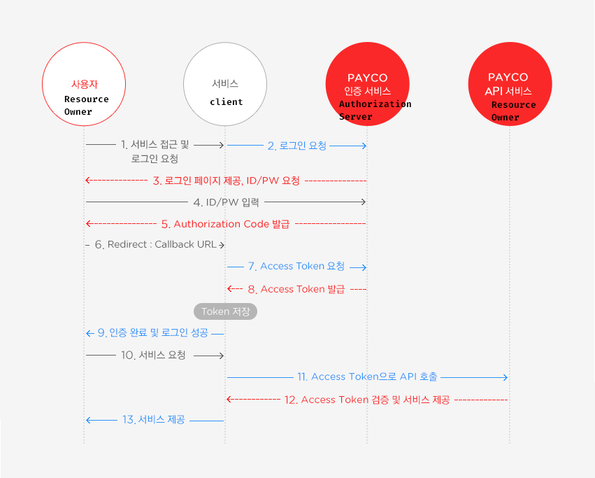

### OAuth 2.0
- [참고링크](https://velog.io/@undefcat/OAuth-2.0-%EA%B0%84%EB%8B%A8%EC%A0%95%EB%A6%AC)
- 로그인,회원가입 서비스 구현을 위해 사용자 개인정보를 받아 저장관리 해야하는 상황
- OAuth 2.0를 사용하여 대부분의 로그인, 개인정보 관리책임을 서브파티 애플리케이션(구글,네이버..)에 위임
  - 사용자가 해당 서비스에 가입 되어있어야함
- 우리 서비스이용 고객이 네이버 회원임을 검증해야 함: Access Token 방식 사용
- 토큰을 이용하여 고객이 안전하게 다른 서비스의 정보를 우리 서비스에 전달

- Access Token
  - 임의의 문자열 값: 토큰 발급 해 준 서비스만 알 수 있음
    - JWT의 경우 Base64 인코딩 되어 있어 정보 볼 수 있음
  - 이 토큰을 이용하여 이 토큰값과 관련된 고객의 정보를 해당 서비스에 요청 가능
  - 해당 서비스는 이 토큰을 검증하고, 발급된게 맞다면 해당 고객의 정보를 넘겨준다 (네이버 -> 우리 서비스 서버)
  - Access Token은 고객이 정보를 넘겨주는 것을 동의함의 징표
  - e.g. 네이버 서비스에서 Access Token 생성하여 우리 서비스로 넘겨줌
  - 서비스에서 access token 넘겨받는 방법
    - 직접 토큰입력: 문자인증처럼 access token이 화면이 출력되고 우리서비스의 토큰입력 페이지에 입력 (현실적으로 불편)
    - 리다이렉트: 네이버 Oauth 서버에서 redirect_uri에 access_token을 담아 (query string) 리다이렉트
    - redirect_uri 개발자센터에 등록
    - 헤더 Authorization

  - 네이버에서 전달받은 Access Token을 통해 고객의 정보조회는 어떻게할까?
    - 네이버 개발자센터 문서에서 제공하는 정보조회 API 활용
```
# 네이버 회원 프로필 조회 API
# GET방식 https://openapi.naver.com/v1/nid/me
# 요청헤더 Authorization: {토큰 타입} {접근 토큰}
```


- 정리: OAuth의 3단계
  1. 서비스 등록
     - 네이버에 자사 서비스 등록
     - redirect_uri등 합의하기
  2. 토큰받기 위한 과정 (사용자가 네이버 회원으로 가입되어 있어야함!)
     - 사용자를 네이버 로그인페이지로 이동
     - 네이버가 사용자를 우리 서비스로 리다이렉트 시키기
  3. 토큰을 이용해 정보요청 (네이버제공 API)

구분| 설명
---|---
Client|	OAuth 2.0을 사용해 서드파티 로그인 기능을 구현할 자사 또는 개인 애플리케이션 서버다.
Recource Owner|	서드파티 애플리케이션 (Google, Facebook, Kakao 등)에 이미 개인정보를 저장(회원가입)하고 있으며 Client가 제공하는 서비스를 이용하려는 사용자, 'Resource' 는 개인정보라고 생각하면 된다.
Resource Server	| 사용자의 개인정보를 가지고있는 애플리케이션 (Google, Facebook, Kakao 등) 서버다.  Client는 Token을 이 서버로 넘겨 개인정보를 응답 받을 수 있다.
Authorization Server	| 권한을 부여(인증에 사용할 아이템을 제공주는)해주는 서버다. 사용자는 이 서버로 ID, PW를 넘겨 Authorization Code를 발급 받을 수 있다. Client는 이 서버로 Authorization Code을 넘겨 Token을 받급 받을 수 있다.



- 출처: PAYCO 개발자센터
  - 사용자: Resource Owner
  - 서비스: Client
  - PAYCO 인증서비스: Authorization Server
  - PAYCO API서비스: Resource Server


