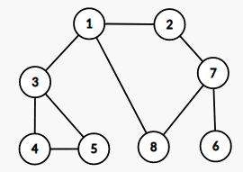

- From 이것이 코딩테스트다 with python

# 01 코딩테스트 개요

## 복잡도 Big-O
- 시간 복잡도 : 알고리즘을 위해 필요한 연산의 횟수
- 공간 복잡도 : 알고리즘을 위해 필요한 메모리의 양

Trade-off Example: memoization 메모리를 많이 사용하여 시간을 비약적으로 줄이는 방법 Ch8


```python
array = [3, 5, 1, 2, 4]
summary = 0

# O(N)
for x in array:
    summary += x

# O(N^2)
for i in array:
    for j in array:
        temp = i*j

```

$O(N)$ 최악의 경우로 복잡도 고려

빅오 표기법 | 명칭
---|---
O(1) | 상수시간 (Constant time)
O(logN) | 로그시간 (Log Time)
O(N) | 선형 시간
O(NlogN) | 로그 선형 시간
O(N^2) |  이차 시간
O(N^3) | 삼차 시간
O(2^n) | 지수 시간

Big-O는 최악의 경우 시간복잡도 e.g.Quick Sort O(NlogN)~O(N^2)

## 시간과 메모리 측정


```python
import time

# 측정 시작
start_time = time.time()

# 프로그램 소스코드

# 측정 종료
end_time = time.time()

elapsed_time = end_time - start_time
print(f"Time elapsed : {elapsed_time}")
```

- 선택정렬의 경우 최악 $O(N^{2})$
- 파이썬 기본정렬 라이브러리 최악의 경우 $O(N\log{}N)$


```python
from random import randint
import time

# 배열에 10,000개의 정수 (a<= 랜덤 <=b) 삽입
# randint(a,b) 또는 randrange(a, b+1)
array = []
for _ in range(10000):
    array.append(randint(1, 100)) # 1<= i <=100 랜덤한 정수

# 선택 정렬 프로그램 성능 측정
start_time = time.time()

# 선택 정렬 프로그램 소스코드
for i in range(len(array)):
    # 가장 작은 원소의 인덱스
    min_index = i
    for j in range(i+1, len(array)):
        if array[min_index ] > array[j]:
            min_index = j
    # 스와프
    array[i], array[min_index] = array[min_index], array[i]

# 선택 정렬 측정 종료
end_time = time.time()
elapsed_time = end_time - start_time
print(f"선택 정렬 걸린 시간 : {elapsed_time}")


# 기본 정렬 라이브러리 성능 측정
start_time = time.time()

# 기본 정렬 라이브러리 사용
array.sort()

end_time = time.time()
elapsed_time = end_time - start_time
print(f"기본 정렬 걸린 시간 : {elapsed_time}")
```

# 02 코딩 테스트 유형 분석

- 알고리즘 기반, Greedy, Implmentation, DFS/BFS 탐색
- Dynamic Programming, Graph Theory (Basic Level)
- 정수론, 최단경로, Dynamic Programming (Contest Competitive Coding Test)

- 출제 비율
  - 구현 > DFS/BFS > 그리디 > 정렬 > Dynamic > 최단경로 > 이진탐색 > 그래프이론

- 카카오
  - "ACM-ICPC** 같은 어려운 알고리즘 설계 능력을 겨루는 문제가 아닌, 업무에서 있을 만한 상황을 가정하여 독창적이고 다양한 분야의 문제..."
  - 그리디, 구현, 문자열, 다양한 케이스고려
- 삼성
  - 예외상황 적절히 처리, 완전탐색, DFS/BFS, 구현유형
- 보통 2~5시간 내에 8개 이하의 문제


Upper Bound : 문제 해결 역량 & 코드포스 블루이상, ACM-ICPC 서울지역 대회 본선 수준

기업 | 날짜 | 풀이 시간 | 문제 개수 | 커트라인 | 주요 문제 유형 | 시험 유형
---|---|---| ---| ---|---|---
라인| 상반기<br>(2020-04-05)| 2시간 30분| 6문제| 4문제|구현, 문자열, 자료구조| 온라인
삼성전자| 상반기<br>(2020-06-07)| 3시간| 2문제| 2문제|완전탐색, 시뮬레이션, DFS/BFS| 오프라인


- 알고리즘 문제풀이 사이트
  - 코드시그널 https://app.codesignal.com
  - 코드포스 https://codeforces.com
  - 정올 http://www.jungol.com
  - 생활코딩 https://opentutorials.org
  - BOJ Slack https://acmicpc.slack.com


# 03 Greedy 알고리즘
- 현재 상황에서 가장 좋아 보이는 것만을 선택하는 알고리즘
- 매 순간 가장 좋아 보이는 것을 선택하며, 현재 선택이 나중에 미칠 영향은 고려 X
- 그리디 알고리즘 정당성 검토 필수 e.g. 큰단위 동전에 작은 단위 동전의 배수 일때만 가능 500, 400, 100는 적용 X
  - 배수가 아닌 무작위 동전 종류인 경우 다이나믹 프로그래밍으로 해결 가능: Ch8


```python
# 거스름돈 N원 일 때, 가장 적은 수의 거스름돈 동전 개수는?
# '가장 큰 화폐 단위부터' 돈 거슬러 줘야 함
# O(N) N: 거스름돈 종류 수
n = 1260
coins = [500, 100, 50, 10]

count = 0
for coin in coins:
    count += n // coin
    n %= coin

print(count)

```


```python
# 크기 N 숫자 배열에서 주어진 수들을 M번 더하여 가장 큰수 만들기
# 특정 인덱스 해당 수가 연속 K번 초과하면 안됨
# 다른 인덱스에 해당수가 같은 경우도 서로 다른 것으로 간주
#
n, m, k = map(int, input().split())

data = list(map(int, input().split()))
data.sort(reverse=True)

sum = 0
count = 0
idx = 0

for _ in range(m):

  for _ in range(k):
    count = count+1
    if count >m:
      break

    sum += data[idx]
    if idx %2 == 1:
      break

  if count >m:
    break

  idx = (idx+1) % 2

print(sum)


# sol2
N,M,K = map(int,input().split())
arr= list(map(int, input().split()))
sum = 0
arr.sort(reverse=True)

if len(arr) <= 1:
  sum = M*arr[0]
else:
  n1= arr[0]
  n2= arr[1]
  count = (M // (K+1))*K + M % (K+1)
  sum += count * n1
  sum += (M-count) * n2

print(sum)
```


```python
# 숫자 카드게임 N x M (1+100)
# 규칙: 행선택 후 행에서 가장 작은 수를 뽑음
# 최종적으로 가장 큰 숫자를 뽑도록 프로그램 작성
# 입력
# 3 3
# 3 1 2
# 4 1 4
# 2 2 2
# 출력 2

import sys

m,n = map(int, input().split())

result = 0
for _ in range(m):
  min_num = min(list(map(int, input().split())))
  if result < min_num:
    result = min_num

print(result)
```


```python
# N이 1이 될때까지
# (1번) N = N-1
# (2번) N을 K로 나눈다
# 2<=N<=100000, 2<=K<=100000,  N >= K
# 1일 될때까지 1또는 2번 수행해야하는 최소 횟수
# 17 4
# 3
# 25 5
# 2
# 25 3
# 6

N, K = map(int, input().split())

count=0
while N > 1:
  if N % K == 0:
    N = N/K
  else:
    N= N-1
  count+=1

print(count)


```

# 04 구현


```python
# top left (1,1) bottom right (N,N)
# 계획서 띄어쓰기 기준 L R U D 문자들이 반복적으로 적혀있음
# 움직일수 없는 곳 이동명령은 무시 됨
# 5
# R R R U D D
# 3 4
N = int(input())
# LRUD
inst = list(input().split())

r=1
c=1
for s in inst:
  if s=='L' and c>1:
    c-=1
  elif s=='R' and c<N:
    c+=1
  elif s=='U' and r>1:
    r-=1
  elif s=='D' and r<N:
    r+=1

print(f'{r} {c}')
print(r, c)
```


```python
# 00시00분00초~N시59분59초 3이 하나라도 포함되는 경우의 수
# 0<=N<=23

N = int(input())
count = 0

for h in range(N+1):
  for m in range(60):
    for s in range(60):
      if '3' in str(h) + str(m) + str(s):
        count+=1

print(count)

```


```python
# 체스판에서 (a~h, 1~8)
# 나이트 위치가 주어졌을때, 이동 가능한 경우의 수
pos = input()
x= int(ord(pos[0]))-int(ord('a'))+1
y = int(pos[1])
moves = [(2,-1),(2,1),(-2,1),(-2,1),(1,2),(1,-2), (-1,2),(-1,-2)]

count = 0
for move in moves:
  dx = x+move[0]
  dy = y+move[1]
  if dx >=1 and dx <=8 and dy>=1 and dy <=8:
    count +=1
print(count)
```

# 05 DFS/BFS

### 자료구조 기초
- Search 탐색
- Data Structure
    - Stack
    - Queue


```python
# 1. Stack
stack = []
# 5-2-3-7
stack.append(5)
stack.append(2)
stack.append(3)
stack.append(7)
# 5-2-3
stack.pop()

# 5-2-3-1-4
stack.append(1)
stack.append(4)
# 5-2-3-1
stack.pop()
print(stack)

# 2.Queue
from collections import deque
queue = deque()
# 5-2-3-7
queue.append(5)
queue.append(2)
queue.append(3)
queue.append(7)
# 2-3-7
queue.popleft()
# 2-3-7-1-4
queue.append(1)
queue.append(4)
# 3-7-1-4
queue.popleft()
```

### 재귀 함수


```python
def recursive_function(i):
    if i==5:
        return
    print(i, '번째 재귀함수에서', i+1, '번째 재귀 함수를 호출합니다.')
    recursive_function(i+1)
    print(i, '번째 재귀 함수를 종료합니다')

recursive_function(1)

def factorial(n):
    if n <=1:
        return 1
    return n* factorial(n-1)

print(factorial(5))
```


-| 메모리| 속도
---|---|---
인접 행렬 | 노드많을 수록 메모리 증가 |
인접 리스트 | 연결된 정보만 저장하므로 효율적 메모리 사용 | 두 노드 연결여부 확인 느림


```python
# 1-(7)-0-(5)-2

# 인접 행렬
#   0  1  2
# 0 0  7  5
# 1 7  0  INF
# 2 5 INF 0
INF = 999999999
graph = [
  [0,7,5]
  , [7, 0 ,INF]
  , [5, INF ,0]
]
print(graph)


# 인접 리스트
# 0->1_7->2_5
# 1->0_7
# 2->0_5
graph = [[] for _ in range(3)]

graph[0].append((1,7))
graph[0].append((2,5))

graph[1].append((0,7))

graph[2].append((0,5))

print(graph)
```

### DFS

- Depth-First Search
    - 깊이 우선 탐색
    - 탐색 시작노드 스택삽입 & 방문처리
    - -> 스택 최상단 노드에 미방문 인접노드(일반적으로 인접노드들 중 가장 작은 숫자 먼저처리) 있으면 그 인접노드를 스택에 넣고 방문처리
    - -> 방문하지 않은 인접노드가 없으면 스택에서 최상단 노드를 꺼냄
    - 인접 행렬
    - 인접 리스트




```python
def dfs(graph, v, visited):
  visited[v] = True
  print(v, end=' ')
  for i in graph[v]:
    if not visited[i]:
      dfs(graph, i, visited)

# DFS 메소드 (인접리스트- 2차원리스트 활용)
graph = [
  []
  , [2,3,8]
  , [1,7]
  , [1,4,5]
  , [3,5]
  , [3,4]
  , [7]
  , [2,6,8]
  , [1,7]
]
visited = [False]*9

dfs(graph,1,visited)
```

    1 2 7 6 8 3 4 5 

### BFS

- Breath-First Search
    - 너비 우선 탐색. 가까운 노드부터 탐색
    - 탐색 시작노드 큐 삽입 & 방문처리
    - -> 큐에서 노드를 꺼내 미방문 인접노드 모두 큐에 삽입 및 방문처리
    - 인접 행렬
    - 인접 리스트


```python
from collections import deque

def bfs(graph, start, visited):
  # 큐Queue 구현을 위해 deque 라이브러리 사용사용
  queue = deque([start])
  # 현재 노드 방문 처리
  visited[start] = True
  # 큐가 빌 때까지 반복
  while queue:
    # 큐에서 하나의 원소를 뽑아 출력
    v = queue.popleft()
    print(v, end=' ')
    for i in graph[v]:
      if not visited[i]:
        queue.append(i)
        visited[i] = True


graph = [
  []
  , [2,3,8]
  , [1,7]
  , [1,4,5]
  , [3,5]
  , [3,4]
  , [7]
  , [2,6,8]
  , [1,7]
]
visited = [False]*9

bfs(graph, 1, visited)
```

    1 2 3 8 7 4 5 6 

-|DFS|BFS
---|---|---
동작원리 | 스택|큐
구현방법|재귀함수 이용 | 큐 자료구조


```python


# 선택 정렬
def selection_sort(arr):
  for i in range(len(arr)):
    min_idx = i
    for j in range(i+1, len(arr)):
      if arr[j] < arr[min_idx]:
        arr[j], arr[min_idx] = arr[min_idx], arr[j]
  print(arr)

# 삽입 정렬
def insertion_sort(arr):
  for i in range(len(arr)):
    for j in range(i,0,-1):
      if arr[j] < arr[j-1]:
        arr[j], arr[j-1] = arr[j-1], arr[j]
      else:
        break 
  print(arr)

# 퀵 정렬
# def quick_sort(arr, start, end):
#   if start >= end:
#     return
#   pivot = start
#   left = start+1
#   right = end

#   while left <= right:
#     while left <= end and arr[left] <= arr[pivot]:
#       left += 1
#     while right > start and arr[right] >= arr[pivot]:
#       right -=1
#     if left > right:
#       arr[right], arr[pivot] = arr[pivot], arr[right]
#     else:
#       arr[right], arr[left] = arr[left], arr[right]

#   quick_sort(arr, start, right-1)
#   quick_sort(arr, right+1, end)
def quick_sort(arr):
  if len(arr) <= 1:
    return arr
  
  pivot = arr[0]
  tail = arr[1:]

  left_side = [x for x in tail if x <= pivot]
  right_side = [x for x in tail if x > pivot]

  return quick_sort(left_side) + [pivot] + quick_sort(right_side)

def counting_sort(arr):
  count_arr = [0] * (max(arr)+1)

  for i in arr:
    count_arr[i] += 1

  for i in range(len(count_arr)):
    for j in range(count_arr[i]):
      print(i, end=' ')


arr = [7, 5, 9, 0, 3, 1, 6, 2, 4, 8]
selection_sort(arr)

arr = [7, 5, 9, 0, 3, 1, 6, 2, 4, 8]
insertion_sort(arr)

arr = [5, 7, 9, 0, 3, 1, 6, 2, 4, 8]
arr = quick_sort(arr)
print(arr)

arr = [7, 5, 9, 0, 3, 1, 6, 2, 9, 1, 4, 8, 0, 5, 2]
counting_sort(arr)

```

    [0, 1, 2, 3, 4, 5, 6, 7, 8, 9]
    [0, 1, 2, 3, 4, 5, 6, 7, 8, 9]
    [0, 1, 2, 3, 4, 5, 6, 7, 8, 9]
    0 0 1 1 2 2 3 4 5 5 6 7 8 9 9 

- 선택 정렬 O(N^2)
- 삽입 정렬 O(N^2)
- 퀵 정렬 O(NlogN)
- 계수 정렬 O(N+K) : 모든 데이터가 양의 정수, 데이터수 N, 최대정수값 K
- 파이썬 정렬 라이브러리 O(NlogN)
  - sorted
  - sort
  - key매개변수를 이용한 정렬기준 설정 가능
